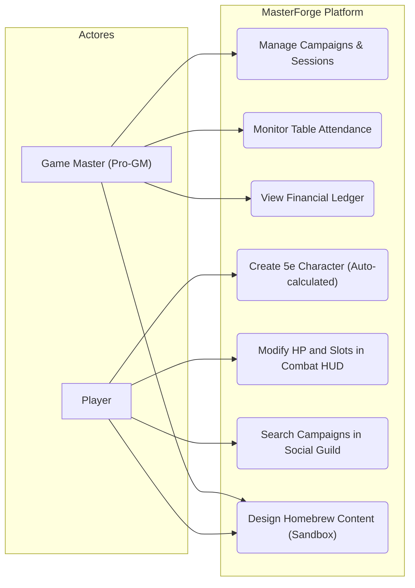
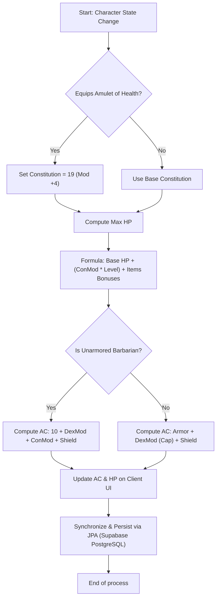

# MASTERFORGE
## Professional ERP and Campaign Management Platform for Dungeon Masters

---

### **1. Cover Page**

*   **Project:** MasterForge: Integrated Business Management System (ERP/CRM), Campaign Matchmaker, and Automated Homebrew Co-Creation Sandbox Workshop for Dungeons & Dragons 5e.
*   **Author:** Pablo Ostenero Reyes
*   **Date:** June 2, 2026
*   **Entity:** End of Degree Project / Systems Engineering Manual
*   **Document Version:** v1.0

---

### **2. Document Index**

1.  [1. Cover Page](#1-cover-page)
2.  [2. Document Index](#2-document-index)
3.  [3. Introduction](#3-introduction)
    *   [3.1 Project Justification: Origin of the Idea](#31-project-justification-origin-of-the-idea)
    *   [3.2 Comparative Analysis of Similar Applications](#32-comparative-analysis-of-similar-applications)
    *   [3.3 Market and Technological Trends](#33-market-and-technological-trends)
    *   [3.4 Project Benefits and Expectations](#34-project-benefits-and-expectations)
4.  [4. Project Description](#4-project-description)
5.  [5. Project Objectives](#5-project-objectives)
6.  [6. Project Scope](#6-project-scope)
7.  [7. Project Requirements](#7-project-requirements)
8.  [8. Project Planning](#8-project-planning)
9.  [9. Risk Management Plan](#9-risk-management-plan)
10. [10. Design and Modeling](#10-design-and-modeling)
    *   [10.1 Prototyping and Wireframes](#101-prototyping-and-wireframes)
    *   [10.2 Technical Architecture Specifications](#102-technical-architecture-specifications)
    *   [10.3 UML and Flow Diagrams](#103-uml-and-flow-diagrams)
11. [11. Installation and Setup](#11-installation-and-setup)
    *   [11.1 Live Production Environments (Quick Access)](#111-live-production-environments-quick-access)
    *   [11.2 Local Sandbox Deployment Procedure](#112-local-sandbox-deployment-procedure)
    *   [11.3 Version Control and Issue Tracking](#113-version-control-and-issue-tracking)
    *   [11.4 Native Mobile Compilation (Android APK with Capacitor)](#114-native-mobile-compilation-android-apk-with-capacitor)
12. [12. Execution Documentation and Quality Plan](#12-execution-documentation-and-quality-plan)
13. [13. Distribution](#13-distribution)
14. [14. Manuals](#14-manuals)
15. [15. Conclusions](#15-conclusions)
16. [16. Annexes](#16-annexes)
17. [17. Index of Tables and Illustrations](#17-index-of-tables-and-illustrations)
18. [18. Bibliography and References](#18-bibliography-and-references)

---

### **3. Introduction**

#### **3.1 Project Justification: Origin of the Idea**
Passion for tabletop role-playing games (TTRPGs), specifically for **Dungeons & Dragons 5th Edition (D&D 5e)**, was the spark for the creation of **MasterForge**. Designing characters and running campaigns reveals a major entry barrier: the huge amount of arithmetic calculations, cross-referencing tables, and mechanical rules that slow down the game and hinder creative freedom.

Existing digital tools act as static databases that limit users to the official core rulebook. When a DM or player wants to bring custom content (**homebrew**) to life — such as custom subclasses or races with advanced mechanics —, conventional software breaks, forcing users to rely on manual math prone to errors.

**MasterForge** was born to shatter these limitations through two key innovations:
1.  **Total Homebrew Automation**: A mathematical rules engine in the backend capable of automatically calculating all derived statistics, level scaling, and resources without requiring complex setups.
2.  **Social Campaign Matchmaker**: Overcoming the difficulty of "finding a group" by facilitating a module that connects DMs and players online to organize dynamic campaigns.

#### **3.2 Comparative Analysis of Similar Applications**

| Platform / App | Strengths | Weaknesses | MasterForge Differential |
| :--- | :--- | :--- | :--- |
| **D&D Beyond** (Official) | • Official license and core rules.<br>• Polished character builder. | • Rigid with custom homebrew (does not allow creating classes).<br>• Expensive (must buy each book). | **Absolute Flexibility**: Forge and automatically calculate custom classes/races visual workshop for free. |
| **Roll20 / Foundry VTT** (Virtual Tabletops) | • Mature virtual combat maps.<br>• Advanced macros support. | • Extremely heavy and complex to host.<br>• Interface not adapted to mobile screens. | **Mobile-First Design**: Reactive character sheet adapted to mobile screens for at-the-table and remote play. |
| **StartPlaying** (Marketplace) | • Excellent directory for professional GMs.<br>• Integrated booking and booking logs. | • No gaming tools: lacks sheets, rules, or generators.<br>• Fictional billing tracking. | **All-in-One Ecosytem**: Unifies campaign social search, DM session management, and live character sheets in one app. |

#### **3.3 Market and Technological Trends**
*   **The Rise of the Professional DM (Pro-GM)**: GMs are professionalizing their campaigns, charging per-session fees on dedicated marketplaces. These creators require an ERP/CRM software system to schedule events and track ledger flows.
*   **Homebrew Culture**: Co-creation interest is massive. Sites like *Homebrewery* host thousands of creations, but they remain static PDF files. MasterForge turns static PDFs into active database entries.
*   **Multiplatform Development**: GMs use desktops for prep, while players prefer mobile phones at the table. Ionic and Angular allow compiling a single codebase for both.

#### **3.4 Project Benefits and Expectations**
*   **For Dungeon Masters**: Saves time on administrative CRM prep and provides absolute freedom to introduce custom homebrew rules that automatically compute.
*   **For Players**: An interactive sheet in their hands calculating attacks, AC, and slots on the fly with official or homebrew content.

---

### **4. Project Description**
**MasterForge** is a multiplatform **SaaS (Software as a Service)** built under a client-server architecture (Frontend SPA/PWA and Backend RESTful) acting as an ERP/CRM solution for professional GMs, alongside a high-fidelity **Automated D&D 5e Rules Engine**.

---

### **5. Project Objectives**
*   **General**: Develop a Campaign CRM/ERP and automated character sheet compiler tailored for D&D 5e.
*   **Specific**:
    *   Implement a Spring Boot/Kotlin Rules Engine resolving complex dynamic formulas (retroactive health, multiclass spell slots, AC sintonization).
    *   Develop a Campaign CRM for GMs to schedule events connected to Discord.
    *   Provide a mobile-first Ionic client.
    *   Build a modular Homebrew Sandbox workshop with AI co-creation narrative assistance and balance reviews.

---

### **6. Project Scope**
*   **Included (MVP)**: Automated 5e rules engine, Campaign CRM scheduling, mobile character sheets (HP, slots, rests), modular Homebrew Forge Sandbox, JWT/BCrypt/2FA security, and simulated billing monedero processor.
*   **Excluded**: 3D dice simulators, virtual graphic battlemaps (VTT), and real credit card gateways (uses safe simulated balances instead).

---

### **7. Project Requirements**

#### **7.1 Functional Requirements (MOSCOW Matrix)**
*   **RF01 (Must)**: Role separation (Jugador client vs Pro-GM admin).
*   **RF02 (Must)**: Campaign CRM panel (session scheduling and simulated attendance ledger).
*   **RF03 (Must)**: Interactive Character Sheet resolving saves, skills, and combat statistics.
*   **RF04 (Must)**: In-combat mutations (currencys, temporary health, spell slot consumption, dynamic rests, and level-ups/multiclassing).
*   **RF05 (Should)**: Sandbox Homebrew Creator (Races, Classes, Subclasses, Spells, Monsters, and Items) with automatic integration in sheets.
*   **RF06 (Should)**: AI Assistant providing narrative support and mechanical balance checks on the custom homebrew draft.
*   **RF07 (Could)**: Account Security MFA (TOTP) and automatic session date notifications on Discord channels.

#### **7.2 Technical Stack and Requirements**
*   **Frontend**: Ionic 8.0 + Angular 20.0 (Standalone components, reactive RxJS, Webpack compilation).
*   **Backend**: Spring Boot 4.0.5 (Kotlin 2.2.21 JVM, JPA Hibernate, Spring Security JWT, Springdoc OpenAPI/Swagger UI, Sam Stevens TOTP).
*   **Database**: PostgreSQL Cloud (Supabase) leveraging JSONB columns for schema-less variables (`choicesJson` and custom homebrew structures).

---

### **8. Project Planning**

#### **8.1 Phases (WBS)**
*   **Phase 1: Analysis & Database Setup** (Weeks 1-2): Schema definitions and Spring JPA setup.
*   **Phase 2: Core Rules Engine** (Weeks 3-4): Character, Spells, and Items REST controllers.
*   **Phase 3: Sandbox Homebrew Workshop** (Weeks 4-5): Custom editors and AI co-creation balance routines.
*   **Phase 4: Campaign CRM & Combat Tracker** (Week 6): Schedules, Discord, and initiative handlers.
*   **Phase 5: Security & Mobile Compilation** (Week 7): BCrypt, JWT, 2FA setup, and Capacitor Android builds.
*   **Phase 6: Integration, E2E Testing, Cloud Launch** (Week 8): Render/GitHub Pages deploys and Audit Runner validations.

---

### **9. Risk Management Plan**

| Risk ID | Description | Impact | Probability | Mitigation Strategy |
|:---|:---|:---:|:---:|:---|
| **R01** | Rules complexity (multiclass spell matrices drift) | High | Medium | Build automated E2E test scripts (`audit_runner.js`) comparing values with a local verified engine. |
| **R02** | Supabase database connection loss | Critical | Low | Implement simple query caching (`CacheConfig`) and Connection Poolers. |
| **R03** | Android compilation conflicts | Medium | Medium | Maintain absolute separation of Ionic configurations and compile early using Android Studio CLI. |

---

### **10. Design and Modeling**

#### **10.1 Prototyping and Wireframes**
Designed following an elegant, mobile-friendly **Dark Mode** scheme:
*   **Main Background**: Very dark gray (`#121212`) reducing strain.
*   **Cards/Sheets**: Anthracite gray (`#1E1E1E`).
*   **Accents**: Old gold or bronze evoking classic fantasy templates.

#### **10.2 Technical Architecture Specifications**
Operates under a decoupled Client-Server architecture:
*   **Spring Boot Kotlin API**: Processes all business requirements, security, and rule algorithms.
*   **Ionic Client**: Resolves views, templates, and triggers in Angular, compilable to native Android platforms.

#### **10.3 UML and Flow Diagrams**

##### **UML Use Case Diagram**
The following diagram details the interactions of the Dungeon Master (Pro-GM) and the Player with MasterForge's subsystems:



##### **D&D 5e Rule Engine Flowchart (Dynamic AC & HP Recalculation)**
The following diagram describes the synchronous algorithmic process triggered when a player updates their character (e.g. equipping a custom magic *Amulet of Health*):



---

### **11. Installation and Setup**

#### **11.1 Live Production Environments (Quick Access)**
MasterForge is fully deployed and operational on cloud clusters:
*   **Frontend UI (GitHub Pages)**: [https://pabloostenero.github.io/MasterForge/](https://pabloostenero.github.io/MasterForge/)
*   **Backend REST API (Render)**: [https://masterforge-4n4g.onrender.com](https://masterforge-4n4g.onrender.com)
*   **Database (Supabase PostgreSQL)**: Active and synchronized with the Render backend.
*   **Native APK releases page (GitHub)**: Precompiled mobile installers can be downloaded directly from: [https://github.com/PabloOstenero/MasterForge/releases/](https://github.com/PabloOstenero/MasterForge/releases/)

#### **11.2 Local Sandbox Deployment Procedure**
To configure a local development sandbox:

##### **Paso 1: Database Setup**
1. Create a local PostgreSQL database named `masterforge_db`.

##### **Paso 2: Start Backend Server**
1. Navigate to `/masterforge-backend/`.
2. Configure credentials in `src/main/resources/application.properties`.
3. Launch via the Gradle wrapper:
   ```bash
   ./gradlew bootRun
   ```
4. Verify port `8080` is active by requesting `/api/health` or accessing Swagger UI: `http://localhost:8080/swagger-ui.html`.

##### **Paso 3: Start Frontend Client**
1. Navigate to `/masterforge-frontend/`.
2. Run package installs:
   ```bash
   npm install
   ```
3. Boot development compiler:
   ```bash
   npm start
   ```
4. Access `http://localhost:8100` on your browser.

#### **11.3 Version Control and Issue Tracking**
*   **Gitflow**: Standard Git flow using a clean `main` branch deployed to production web environments, and isolated `feature/` or `dev/` branches merged via PR after audit runs.
*   **GitHub Issues**: Incidencias, calculations bugs, and tasks categorized under `bug`, `enhancement`, and `documentation`.

#### **11.4 Native Mobile Compilation (Android APK with Capacitor)**
We use Capacitor to wrap our Ionic web build inside an Android native container:
```bash
cd masterforge-frontend
ionic build --prod
npx cap add android
npx cap sync android
npx cap open android
```
This boots Android Studio loaded with the Gradle configuration, letting you build the debug APK via `Build > Build Bundle(s) / APK(s) > Build APK(s)`.

---

### **12. Execution Documentation and Quality Plan**

#### **12.1 Operational Quality Protocols**
1.  **REST Health Checks**: Native public `/api/health` route.
2.  **Structured JSON Logs**: Production outputs direct JSON formats to the central Render dashboard.
3.  **Hot Database Audits**: DBeaver connected securely via SSL pools to check PostgreSQL integrity.

#### **12.2 Integration Tests (Audit Runner)**
Our end-to-end verification script **`audit_runner.js`** validates the engine calculations and database persistence automatically:
*   **Scenario 1: Sorcadin Multiclass**: Creates a Paladin 2/Sorcerer 3 character. Verifies that the rules engine combines caster levels and generates the exact combined spell slot matrix.
*   **Scenario 2: Warlock Rest Mechanics**: Creates a Warlock 3/Cleric 1. Executes short rests and long rests, confirming Pact slots recover separately from spellcasting slots.
*   **Scenario 3: Amulet of Health Retroactivity**: Equips an Amulet of Health. Checks dynamic Max HP increases (+10) and unarmored AC changes instantly.
*   **Scenario 4: Evocation Wizard choices**: Level-up from 1 to 2. Chooses Evocation subclass, verifying choices persist in the database's `choicesJson` column.

#### **12.3 Quality Key Metrics**
*   **REST API latency**: 95% of queries resolved under 2 seconds (**percentil p95 < 2s**).
*   **Supabase Cloud Uptime**: Database stability metrics over **99.9%** annual.
*   **Rules Engine Error Rate**: **0.00%** on rules calculations under Audit validations.

---

### **13. Distribution**
*   **Backend Spring Boot**: Contenerized via a multi-stage **Docker** file (`Dockerfile`) compiled on `gradle:8.5-jdk17` and running on a lightweight **Eclipse Temurin JRE 17** base container.
*   **Frontend PWA**: Compiled via Angular tree-shaking into the `/www` production bundle. Deployed on **GitHub Pages** using a bypass `.nojekyll` file and an enrutamiento fallback `404.html` index routing wrapper to prevent deep-link routing refresh issues.

---

### **14. Manuals**
Detailed technical documentation and user guides are linked:
*   **[Local Sandbox Setup Guide](https://github.com/PabloOstenero/MasterForge/blob/main/documentation/GETTING_STARTED.md)**: Steps to install and boot developers environments.
*   **[User Guide (Player & DM)](https://github.com/PabloOstenero/MasterForge/blob/main/documentation/USER_MANUAL.md)**: Interactive guides covering character management, 2FA, Discord, campaign searching, and live Combat tracking.
*   **[Security & MFA manual](https://github.com/PabloOstenero/MasterForge/blob/main/documentation/2FA_SECURITY.md)**: Underpinnings of the TOTP security and backup recovery workflows.

---

### **15. Conclusions**

#### **15.1 Summary of Accomplishments**
MasterForge unifies rules precision and co-creation freedom. The MVP delivers an absolute robust technical implementation with dynamic rules calculations, transactional simulated balances, and decoupled mobile-ready frameworks.

#### **15.2 Project Viability**
*   **Technical**: Proven via clean CI/CD deployments and E2E mathematical test validations.
*   **Legal**: Legally CC compliant (SRD 5.1 contents only) and GDPR compliant (encrypted user tokens and 2FA credentials).
*   **Commercial**: Simulates a fully active Pro-GM marketplace business model at $0 server maintenance costs.

#### **15.3 Future Work & Roadmap**
*   **D&D 5e Rules Upgrades**: Implement **Feats (Dotes)**, active in-combat **Conditions/Estados**, and automated inventory **Weight Encumbrance**.
*   **AI Homebrew Assistance**: Integrate a local open-source LLM (e.g. Llama 3) inside the creation builder to assist creators draft lore and audit mechanical balance against the SRD 5.1 mathematical averages.

---

### **16. Annexes**
Additional system design models are available:
*   [English Planning & Design Document](https://github.com/PabloOstenero/MasterForge/blob/main/documentation/masterforge_planning_design.md)
*   [English System Design Document](https://github.com/PabloOstenero/MasterForge/blob/main/documentation/system_design_masterforge.md)
*   [English System Implementation Report](https://github.com/PabloOstenero/MasterForge/blob/main/documentation/system_implementation_masterforge.md)
*   [MasterForge Testing Guide and Report](https://github.com/PabloOstenero/MasterForge/blob/main/documentation/TESTING.md)

---

### **17. Index of Tables and Illustrations**

#### **17.1 Index of Tables**
*   **Table 7.1:** MOSCOW Requirements Matrix (RF01-RF07).
*   **Table 7.2:** Non-Functional System Requirements (RNF01-RNF04).
*   **Table 8.1:** 8-Week Scheduling Gantt Phases (Phases 1 to 6).
*   **Table 8.2:** Hardware and Software Resources Inventory.
*   **Table 9.1:** Risk Assessment and Mitigation Matrix.
*   **Table 11.1:** Operational Cloud Deployed Live Environments.
*   **Table 12.1:** Quality API Performance SLA indicators.

#### **17.2 Index of Illustrations**
*   **Illustration 10.1:** MasterForge UML Use Case Diagram.
*   **Illustration 10.2:** D&D 5e Rules Engine Algorithmic Flowchart.
*   **Illustration 12.1:** Audit Runner End-to-End Test Sequence.

---

### **18. Bibliography and References**
*   **Wizards of the Coast (2016):** *Dungeons & Dragons 5th Edition System Reference Document (SRD 5.1)*.
*   **IETF RFC 6238 (2011):** *TOTP: Time-Based One-Time Password Algorithm*.
*   **Spring Boot & Kotlin Development Official Reference Manuals.**
*   **Angular SPA & Ionic Multiplatform documentation.**
