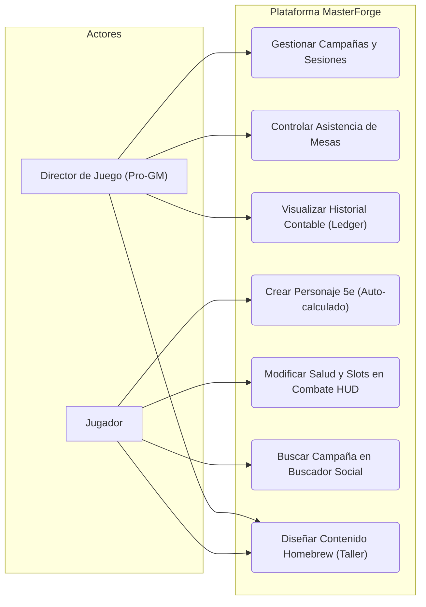
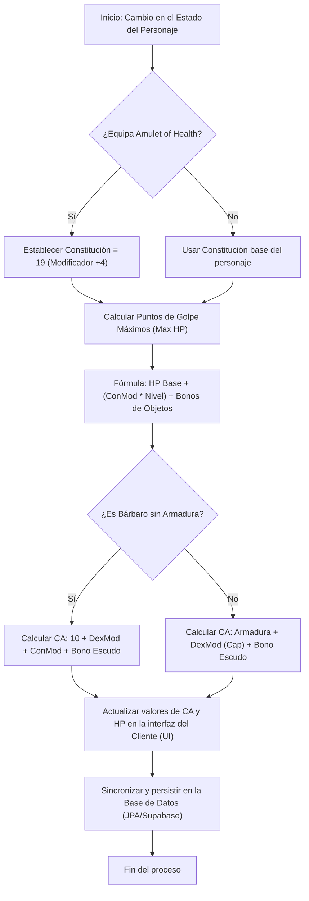

# MASTERFORGE
## Plataforma ERP y Gestor de Campañas Profesional para Directores de Juego

---

### **1. Portada**

*   **Proyecto:** MasterForge: Sistema Integrado de Gestión Empresarial (ERP/CRM), Buscador de Partidas y Taller de Creación Homebrew Automatizado para Dungeons & Dragons 5e.
*   **Autor:** Pablo Ostenero Reyes
*   **Fecha de Presentación:** 2 de Junio de 2026
*   **Entidad:** Proyecto Fin de Ciclo / Manual de Ingeniería del Sistema
*   **Versión del Documento:** v1.0

---

### **2. Índice del Documento**

1.  [1. Portada](#1-portada)
2.  [2. Índice del Documento](#2-índice-del-documento)
3.  [3. Introducción](#3-introducción)
    *   [3.1 Justificación del proyecto: origen de la idea](#31-justificación-del-proyecto-origen-de-la-idea)
    *   [3.2 Análisis comparativo de aplicaciones similares](#32-análisis-comparativo-de-aplicaciones-similares)
    *   [3.3 Tendencias del mercado y tecnológicas](#33-tendencias-del-mercado-y-tecnológicas)
    *   [3.4 Beneficios y expectativas del proyecto](#34-beneficios-y-expectativas-del-proyecto)
4.  [4. Descripción del Proyecto](#4-descripción-del-proyecto)
5.  [5. Objetivos del Proyecto](#5-objetivos-del-proyecto)
6.  [6. Alcance del Proyecto](#6-alcance-del-proyecto)
7.  [7. Requisitos del Proyecto](#7-requisitos-del-proyecto)
8.  [8. Planificación del Proyecto](#8-planificación-del-proyecto)
9.  [9. Plan de Gestión de Riesgos](#9-plan-de-gestión-de-riesgos)
10. [10. Diseño y Modelado](#10-diseño-y-modelado)
    *   [10.1 Prototipado y Wireframes](#101-prototipado-y-wireframes)
    *   [10.2 Especificaciones Técnicas de la Arquitectura](#102-especificaciones-técnicas-de-la-arquitectura)
    *   [10.3 Diagramas UML y de Flujo](#103-diagramas-uml-y-de-flujo)
11. [11. Instalación y Preparación](#11-instalación-y-preparación)
    *   [11.1 Entorno de Producción en Vivo (Acceso Rápido)](#111-entorno-de-producción-en-vivo-acceso-rápido)
    *   [11.2 Procedimiento de Despliegue Local Sandbox](#112-procedimiento-de-despliegue-local-sandbox)
    *   [11.3 Control de Versiones e Incidencias](#113-control-de-versiones-e-incidencias)
    *   [11.4 Compilación Móvil Nativa (Android APK con Capacitor)](#114-compilación-móvil-nativa-android-apk-con-capacitor)
12. [12. Documentación de Ejecución y Plan de Calidad](#12-documentación-de-ejecución-y-plan-de-calidad)
13. [13. Distribución](#13-distribución)
14. [14. Manuales](#14-manuales)
15. [15. Conclusiones](#15-conclusiones)
16. [16. Anexos](#16-anexos)
17. [17. Índice de Tablas e Imágenes](#17-índice-de-tablas-e-imágenes)
18. [18. Bibliografía y Referencias](#18-bibliografía-y-referencias)

---

### **3. Introducción**

#### **3.1 Justificación del proyecto: origen de la idea**
La pasión por los juegos de rol de mesa (TTRPGs) y, en específico, por **Dungeons & Dragons 5ª Edición (D&D 5e)**, ha sido la chispa fundamental para la creación de **MasterForge**. Al adentrarse en el diseño de personajes y la dirección de campañas, se hace evidente una gran barrera de entrada: la enorme cantidad de cálculos aritméticos, tablas cruzadas y reglas mecánicas que ralentizan el juego y dificultan la libertad creativa de los jugadores y Dungeon Masters.

Las herramientas digitales existentes a menudo actúan como bases de datos estáticas o "hojas de cálculo glorificadas" que limitan al usuario a las reglas oficiales del libro básico. Cuando un Dungeon Master o jugador desea dar vida a contenido personalizado (**homebrew**) —tales como nuevas clases, subclases o razas con mecánicas avanzadas—, el software convencional se rompe, obligando a los usuarios a recurrir al papel, a hacer cálculos manuales propensos a errores o a forzar parches toscos en las plataformas comerciales.

La idea de **MasterForge** nació con el firme propósito de romper estas limitaciones a través de dos innovaciones clave:
1.  **Automatización Total del Homebrew**: Desarrollar un motor de reglas matemático y flexible que permita forjar nuevas clases, razas y objetos mágicos de forma que el sistema calcule automáticamente todas sus estadísticas derivadas, escalados de nivel, competencias y recursos, sin requerir código ni configuraciones complejas.
2.  **Buscador de Partidas y Conexión Social**: Superar la tradicional dificultad de "encontrar grupo" facilitando un módulo que conecte de forma fluida a directores y jugadores en línea para organizar sesiones y campañas dinámicas.

#### **3.2 Análisis comparativo de aplicaciones similares**
Para entender la propuesta de valor única de **MasterForge**, se ha realizado un estudio de las soluciones predominantes en el ecosistema TTRPG actual:

| Plataforma / Aplicación | Fortalezas | Debilidades | Propuesta Diferencial de MasterForge |
| :--- | :--- | :--- | :--- |
| **D&D Beyond** (Oficial) | • Licencia oficial y catálogo completo de reglas.<br>• Constructor de personajes pulido paso a paso. | • Extremadamente rígido con el contenido homebrew (no permite crear clases ni alterar cálculos estructurales de forma nativa).<br>• Muy costoso (exige pagar por cada libro digital). | **Flexibilidad Absoluta**: Forja y cálculo automático de cualquier clase o raza custom con un taller visual libre de barreras y gratuito. |
| **Roll20 / Foundry VTT** (Virtual Tabletops) | • Tableros de combate virtuales (VTT) muy maduros con cuadrículas y dados 3D.<br>• Gran soporte de macros y automatización de tiradas en mesa. | • Extremadamente pesados, complejos de configurar y hostear.<br>• Interfaz no adaptada a móviles (mobile-first), dificultando el juego rápido o el uso presencial alrededor de una mesa física física física. | **Diseño Mobile-First**: Hoja de personaje e interactividad adaptada a pantallas móviles rápidas para su uso tanto remoto como presencial, libre de la sobrecarga de un motor gráfico 3D. |
| **StartPlaying** (Marketplace) | • Directorio excelente para encontrar partidas profesionales.<br>• Integración de reservas y cobros simplificados. | • Cero herramientas de juego: no cuenta con hojas de personaje, ni reglas, ni generadores de contenido.<br>• Es únicamente un portal transaccional de negocios. | **Ecosistema Todo en Uno**: Unifica la búsqueda social de partidas, la gestión de sesiones del GM y el juego en vivo con hojas automáticas en una única app sin fricciones. |

#### **3.3 Tendencias del mercado y tecnológicas**
*   **El Auge del DM Profesional (Pro-GM)**: En los últimos años, el rol de director de juego se ha profesionalizado. Cientos de creadores ofrecen sesiones de pago a través de suscripciones o cuotas por sesión en plataformas como Patreon o plataformas dedicadas. Estos directores necesitan herramientas de nivel profesional (ERP/CRM ligero) que les ayuden a gestionar sus calendarios, registrar la asistencia y medir su crecimiento operativo.
*   **La Cultura del Co-Diseño (Homebrew)**: El interés de la comunidad por crear sus propios universos ha crecido exponencialmente. Sitios como *Homebrewery* o *GM Binder* acumulan miles de visitas diarias, pero sus salidas son simples archivos PDF estáticos. MasterForge responde a la necesidad de "digitalizar y dar vida" a esos PDFs estáticos traduciéndolos a datos computables interactivos.
*   **Desarrollo Multiplataforma**: La tendencia tecnológica obliga a ofrecer experiencias web de escritorio robustas para el DM (que planifica en ordenador) y hojas de personaje ligeras e interactivas en el móvil para los jugadores en mesa. Ionic y Angular permiten compilar esta experiencia única de manera fluida y nativa.

#### **3.4 Beneficios y expectativas del proyecto**
*   **Para los Dungeon Masters**: Ahorro de tiempo masivo en la gestión de calendarios, base de datos de sus clientes/jugadores, y facilidad absoluta para introducir sus mundos de campaña personalizados (razas/clases exclusivas) que se calculen solos.
*   **Para los Jugadores**: Acceso a una hoja de personaje en el móvil que calcula sus ataques, CA, conjuros y características dinámicamente, con la libertad de elegir contenido oficial o creaciones originales del DM de forma transparente.
*   **Para la Comunidad de Rol**: Un puente digital que facilita la búsqueda de mesas online y el juego cooperativo sin importar la distancia, democratizando el acceso al hobby y unificando herramientas antes dispersas.

---

### **4. Descripción del Proyecto**

#### **4.1 Tipo de proyecto**
**MasterForge** es una **aplicación web y móvil multiplataforma** diseñada bajo una arquitectura desacoplada de tipo cliente-servidor (Frontend SPA/PWA y Backend RESTful). A nivel de modelo de negocio, se enmarca como un **SaaS (Software como Servicio)** que fusiona capacidades operativas de **ERP (Planificación de Recursos Empresariales)** y **CRM (Gestión de Relaciones con Clientes)** para creadores de rol profesionales, junto con un **Motor Mecánico y Taller de Creación Homebrew** de alta fidelidad.

#### **4.2 Características principales**
*   **Gestor CRM y Programador de Campañas (Pro-GM)**: Un panel administrativo que permite a los Directores de Juego programar sesiones individuales o campañas continuas, controlar los aforos de mesas físicas o virtuales, registrar la asistencia de jugadores y automatizar el estatus financiero de las sesiones (pendientes, cobradas, bonificadas) para un control de caja transparente.
*   **Hoja de Personaje Interactiva e Inteligente**: Interfaz dinámica optimizada para dispositivos móviles que calcula de manera instantánea y en tiempo real estadísticas de combate complejas, modificadores, competencias de salvación/habilidades, Clase de Armadura unarmored/armored y slots de conjuro.
*   **Taller de Forja Homebrew Modular**: Un conjunto de herramientas y formularios técnicos especializados que facultan al usuario para diseñar de forma personalizada cualquier elemento mecánico (objetos mágicos, hechizos, razas, clases y subclases), permitiendo que el motor de cálculos del sistema los procese, valide y escale de forma automática e integrada como si fuesen oficiales.
*   **Buscador Social de Partidas (Matchmaking)**: Módulo interactivo de publicación y búsqueda de campañas en línea con filtros específicos y reales de búsqueda por texto parcial (coincidencia en nombre o descripción), nombre del director de juego (DM), rangos de precios, capacidad máxima/mínima de jugadores y disponibilidad de vacantes (plazas libres). Facilita que los jugadores encuentren su mesa idónea de forma rápida y que los GMs completen sus aforos sin fricción.
*   **Seguridad y Control de Roles (RBAC)**: Autenticación robusta sin estado mediante tokens JWT, hashing seguro de credenciales con BCrypt y un sistema estricto de roles que divide privilegios y visualizaciones entre Dungeon Masters y Jugadores.

#### **4.3 Usuarios destinatarios**
*   **Directores de Juego Profesionales (Pro-GMs)**: Directores experimentados que monetizan su creatividad organizando partidas profesionales privadas u online, requiriendo un panel unificado para reducir drásticamente sus tiempos de gestión administrativa.
*   **Creadores e Ideadores Independientes (Homebrewers)**: Desarrolladores de contenido creativo TTRPG que diseñan mecánicas de juego personalizadas y necesitan un motor digital que compute, valide y estructure sus reglas.
*   **Jugadores de Rol de Todos los Niveles**: Desde principiantes que necesitan que el sistema guíe y automatice sus cálculos para aprender a jugar sin la fatiga matemática de las reglas, hasta veteranos que buscan agilizar el juego en vivo desde su teléfono inteligente.

---

### **5. Objetivos del Proyecto**

#### **5.1 Objetivo General**
Diseñar, implementar y desplegar una plataforma multiplataforma integrada que unifique la gestión comercial y operativa de los Directores de Juego profesionales mediante herramientas CRM/ERP ligeras, mientras automatiza con 100% de fidelidad matemática las mecánicas de D&D 5e y proporciona un entorno abierto para la forja y cálculo dinámico de contenido homebrew (clases, razas y objetos personalizados) y la búsqueda y conexión social de partidas online.

#### **5.2 Objetivos Específicos**
1.  **Desarrollar un Motor de Reglas 5e Altamente Coherente**: Diseñar algoritmos lógicos en el backend (Kotlin/Spring Boot) y frontend (Angular/Ionic) que automaticen el cálculo de dependencias mecánicas complejas (escalados por nivel de puntos de golpe, modificadores de características retroactivos, y tablas de Clase de Armadura unarmored/armored) basándose en el SRD 5.1 estándar.
2.  **Facilitar la Creación Modular Homebrew Libre de Código**: Implementar una interfaz modular de formularios en el cliente que permita forjar clases y razas personalizadas, asegurando que todos sus rasgos derivados sean mapeados e interpretados dinámicamente por el motor de la hoja de personaje sin alterar el código fuente.
3.  **Proveer Herramientas Administrativas CRM Robustas para GMs**: Construir un panel de control para GMs que automatice el registro de sus jugadores recurrentes, el control de calendarios y horarios, la asistencia a sesiones y el seguimiento e histórico de pagos.
4.  **Optimizar el Rendimiento y Portabilidad del Cliente**: Diseñar una interfaz interactiva mobile-first con Ionic y Angular que cargue de forma ultra-ligera en navegadores móviles convencionales (con tiempos de respuesta de API inferiores a los 2 segundos p95) idónea para mesas presenciales sin cobertura excesiva.
5.  **Asegurar la Persistencia y Coherencia Multiclase en Base de Datos**: Modelar esquemas relacionales y de datos semiestructurados (JSONB) en PostgreSQL/Supabase que resuelvan la persistencia de personajes híbridos multiclasificados, gestionando con precisión la asignación de slots de conjuros agregados y el consumo individual de dados de golpe por clase.
6.  **Garantizar la Seguridad, Cumplimiento Legal y Privacidad de los Usuarios**: Blindar el flujo de datos sensibles con cifrado JWT, hashing BCrypt, roles de acceso restringido en base de datos y cumplir estrictamente los requisitos legales de la licencia Creative Commons del SRD 5.1 y políticas de privacidad GDPR/RGPD.

### **6. Alcance del Proyecto**

#### **6.1 Qué incluye el proyecto (MVP)**
El alcance funcional del Producto Mínimo Viable (MVP) de **MasterForge** está diseñado para ofrecer una experiencia integrada y totalmente operativa que se divide en los siguientes bloques:
*   **Motor Mecánico de D&D 5e**: Interpretación y cálculo automático de estadísticas del personaje limitadas al contenido del documento oficial SRD 5.1. Esto incluye la deducción dinámica de competencias, habilidades, salvaciones, iniciativa, percepción pasiva, salud máxima/actual y Clase de Armadura unarmored y armored.
*   **Taller Homebrew Fiel**: Panel modular de creación que interactúa con la base de datos para almacenar y estructurar objetos mágicos, hechizos, razas, clases y subclases creadas por el usuario, almacenando información compleja y semiestructurada de forma nativa a través de columnas relacionales y objetos JSONB.
*   **ERP/CRM para Directores de Juego (Pro-GMs)**: Capacidad para dar de alta campañas públicas o privadas, programar sesiones, controlar el cupo de participantes de las mesas, registrar la asistencia interactiva de los jugadores y gestionar la contabilidad local del DM (histórico de cobros, estatus de sesión pagada, pendiente o exenta).
*   **Buscador y Matchmaking Real**: Buscador de partidas públicas que consume la API del backend mediante un query nativo de filtrado de alta eficiencia. Permite buscar campañas activas por coincidencia de texto (en nombre, descripción y creador), nombre del DM (`dmName`), rango de precios por sesión (`minPrice`/`maxPrice`), límites de aforo de jugadores (`minPlayers`/`maxPlayers`) y disponibilidad de plazas libres (`availableOnly`).
*   **Seguridad y Sesiones de Usuario**: Login y registro de usuarios diferenciado por privilegios mediante Roles (RBAC), protegido mediante tokens JWT firmados en el backend y contraseñas cifradas irreversiblemente mediante hashing con sal.

#### **6.2 Límites y restricciones (Fuera de alcance)**
Con el fin de asegurar la viabilidad del desarrollo y mantener el foco en la agilidad móvil y el soporte a mesas de rol físicas y virtuales ligeras, se excluyen deliberadamente las siguientes características:
*   **Tablero Virtual de Combate (VTT - Virtual Tabletop)**: **MasterForge** no es un VTT. No incluye cuadrículas de mapas interactivas en 2D o 3D, movimiento en tiempo real de tokens/miniaturas, ni renderizado gráfico de dados 3D con físicas. Su propósito es ser un compañero digital ligero de hojas y gestión comercial.
*   **Procesamiento de Pasarelas Bancarias Reales**: La aplicación no procesa transacciones bancarias reales ni integra servicios financieros como Stripe, PayPal o Redsys en esta fase. El seguimiento financiero e ingresos se realiza mediante un ledger contable interno simulado que el GM gestiona administrativamente para control de caja.
*   **Sistemas de VoIP y Canales de Audio Integrados**: No se incluye un sistema WebRTC o de llamadas grupales integrado. La comunicación de voz y video en las partidas se delega enteramente a plataformas externas especializadas (como servidores de Discord).

---

### **7. Requisitos del Proyecto**

#### **7.1 Requisitos funcionales**
El sistema se rige por un conjunto de requerimientos priorizados bajo la metodología clásica MoSCoW:

| ID Req. | Descripción funcional | Prioridad |
| :--- | :--- | :--- |
| **RF01** | El sistema debe distinguir visual y operativamente entre roles de Director de Juego (Pro-GM) y Jugador (RBAC). | **MUST (Debe)** |
| **RF02** | Los Pro-GMs deben poder programar campañas/sesiones, gestionar aforos y registrar el estatus financiero de cobro de sus mesas. | **MUST (Debe)** |
| **RF03** | Los jugadores deben poder construir personajes de D&D 5e de forma guiada con cálculos automáticos de sus modificadores y stats. | **MUST (Debe)** |
| **RF04** | El cliente debe ofrecer una hoja interactiva en tiempo real para combate (gestión de HP actual/temporal y slots de conjuros consumidos). | **MUST (Debe)** |
| **RF05** | La plataforma debe proveer un taller de homebrew modular para registrar y automatizar mecánicamente objetos, conjuros, razas y clases custom. | **MUST (Debe)** |
| **RF06** | El buscador de partidas debe permitir a los jugadores filtrar campañas públicas por texto, DM, rangos de precio, aforo y plazas libres. | **MUST (Debe)** |
| **RF07** | El sistema debe contar con un panel de gestión de activos donde el GM organice sus colecciones homebrew de la comunidad adquiridas. | **SHOULD (Debería)** |

#### **7.2 Requisitos técnicos**
*   **Capa Cliente (Frontend)**: Construido con **Ionic Framework v7+** y **Angular v17+** en TypeScript. Implementa programación reactiva con **RxJS** para la sincronización de la UI, inyección global de interceptores HTTP para la gestión automatizada de cabeceras JWT, y un sistema de estilos responsive mobile-first desarrollado en SCSS.
*   **Capa de Servicio (Backend)**: Desarrollado en **Kotlin** y **Spring Boot v3+** empleando Gradle como gestor de dependencias type-safe. La lógica de negocio está desacoplada en controladores REST y servicios transaccionales protegidos por Spring Security.
*   **Capa de Persistencia (Base de Datos)**: Base de datos relacional **PostgreSQL v15+** hospedada de forma en la nube en **Supabase**. El acceso se gestiona a través de JPA/Hibernate con pools de conexión optimizados mediante **HikariCP**. Emplea tipos de datos avanzados de PostgreSQL como UUID para IDs e índices nativos sobre JSONB para almacenar dinámicamente opciones de características y configuraciones flexibles de homebrew.
*   **Distribución y Entorno Cloud**: Compilación y empaquetado del backend mediante un flujo Docker multi-stage desplegado en la nube de **Render**. Despliegue de los activos estáticos del frontend en **GitHub Pages** con inyección de fallback SPA (`404.html`) para resolver el enrutamiento profundo de Angular. Comunicaciones blindadas bajo protocolo criptográfico **HTTPS/SSL**.

#### **7.3 Requisitos legales o normativos**
*   **Cumplimiento de Propiedad Intelectual (SRD 5.1 CC-BY-4.0)**: Todo el contenido básico precargado del sistema (monstruos, clases, razas y conjuros) se rige bajo la licencia **Creative Commons Atribución 4.0 Internacional** liberada por Wizards of the Coast para el Documento de Referencia del Sistema de D&D 5.1. Esto garantiza que MasterForge cumple rigurosamente la ley de derechos de autor y opera en un marco legalmente seguro.
*   **Reglamento General de Protección de Datos (RGPD / GDPR)**: Al almacenar información personal identificable (nombres, correos electrónicos de jugadores, históricos de asistencia y sesiones organizadas por los DMs), la aplicación cumple normativas de privacidad:
    1.  *Seguridad de las credenciales:* Hashing unidireccional irreversible de contraseñas mediante algoritmo **BCrypt** con un factor de coste mínimo de 12 rondas de salt.
    2.  *Sesiones sin estado:* Empleo de tokens **JWT** auto-contenidos de corta duración firmados criptográficamente para evitar el almacenamiento de sesiones en el servidor.
    3.  *Principio de minimización:* Solo se solicitan y almacenan los datos estrictamente necesarios para operar las funcionalidades CRM de la plataforma.

---

### **8. Planificación del Proyecto**

#### **8.1 Estructura de Desglose de Trabajo (EDT)**
El proyecto se ha dividido de forma jerárquica en seis fases clave para garantizar un desarrollo ordenado e incremental:
1.  **Fase 1: Análisis e Ingeniería de Requisitos**
    *   Definición de especificaciones y reglas mecánicas D&D 5e (SRD 5.1).
    *   Estudio del modelo comercial Pro-GM y estructuración contable simulada.
    *   Diseño legal del cumplimiento de privacidad (GDPR) y licencias (Creative Commons).
2.  **Fase 2: Diseño y Arquitectura**
    *   Modelado lógico y relacional de base de datos PostgreSQL en Supabase.
    *   Diseño del esquema semiestructurado JSONB para el almacenamiento homebrew.
    *   Diseño de enrutamientos de la SPA y patrones de controladores en el Backend.
3.  **Fase 3: Desarrollo del Core API (Backend)**
    *   Inicialización y configuración del boilerplate Spring Boot y Kotlin.
    *   Implementación de seguridad perimetral: Autenticación JWT y hashing BCrypt.
    *   Desarrollo de controladores y lógica transaccional de personajes, campañas, ledger contable de sesiones e integraciones con Supabase.
4.  **Fase 4: Desarrollo de la Interfaz (Frontend)**
    *   Configuración del boilerplate de Ionic y Angular.
    *   Implementación de interceptores HTTP para tokens JWT e inyección de rutas.
    *   Diseño de la hoja interactiva de personaje, constructor guiado, panel CRM y taller homebrew.
5.  **Fase 5: Pruebas e Integración**
    *   Diseño y ejecución del pipeline de auditoría automática (`audit_runner.js`) para evitar desvíos en los cálculos de CA y HP.
    *   Pruebas unitarias de controladores, integración de seguridad y testing manual de UX.
6.  **Fase 6: Despliegue y Distribución (CI/CD)**
    *   Contenerización del backend mediante Dockerfile multi-stage y lanzamiento en Render.
    *   Configuración de GitHub Pages con fallback `404.html` para la SPA.
    *   Auditoría de conexiones seguras HTTPS y rendimiento final.

#### **8.2 Cronograma del Proyecto (Gantt)**
Se ha estimado un plazo de ejecución de **8 semanas** desglosado de la siguiente manera:

| Tarea / Fase | Sem. 1 | Sem. 2 | Sem. 3 | Sem. 4 | Sem. 5 | Sem. 6 | Sem. 7 | Sem. 8 | Responsable |
| :--- | :---: | :---: | :---: | :---: | :---: | :---: | :---: | :---: | :---: |
| **Fase 1: Requisitos y Licencias** | █ | | | | | | | | P. Ostenero |
| **Fase 2: Arquitectura y Modelado DB** | █ | █ | | | | | | | P. Ostenero |
| **Fase 3: Desarrollo Backend & API** | | █ | █ | █ | | | | | P. Ostenero |
| **Fase 4: Desarrollo Frontend & UI** | | | | █ | █ | █ | | | P. Ostenero |
| **Fase 5: Matchmaking & Forja Homebrew** | | | | | | █ | █ | | P. Ostenero |
| **Fase 6: Pruebas de Integración (Audit)** | | | | | | | █ | █ | P. Ostenero |
| **Fase 7: Despliegue Cloud & CI/CD** | | | | | | | | █ | P. Ostenero |

#### **8.3 Recursos necesarios**
*   **Recursos de Hardware**: Un ordenador de desarrollo con procesador multi-núcleo (mínimo Intel Core i5/Ryzen 5), 16 GB de memoria RAM para la ejecución simultánea de contenedores Docker y servidores locales, y almacenamiento sólido SSD.
*   **Recursos de Software (Gratuitos/Open-Source)**:
    *   *IDE y Editores:* IntelliJ IDEA (Edición Comunitaria) para Kotlin, Visual Studio Code para Angular e Ionic CLI.
    *   *Base de Datos:* PgAdmin 4 / DBeaver Community Edition para la administración local de PostgreSQL.
    *   *Testing:* Postman para pruebas de endpoints de API REST.
    *   *Versionado:* Git y GitHub como repositorio central.
    *   *Servicios Cloud:* Render (Capa gratuita para API), GitHub Pages (Hospedaje de cliente) y Supabase (Base de datos PostgreSQL en la nube).
*   **Recursos Humanos**: 1 desarrollador full-stack (Pablo Ostenero Reyes), actuando simultáneamente como gestor de proyecto, analista de negocio, arquitecto de software, programador y analista de calidad (QA).

---

### **9. Plan de Gestión de Riesgos**

#### **9.1 Identificación y Evaluación de Riesgos**
A continuación se detallan los riesgos potenciales que podrían comprometer la entrega, la estabilidad técnica o el cumplimiento legal del proyecto:

| ID | Riesgo Identificado | Probabilidad | Impacto | Nivel de Riesgo |
| :--- | :--- | :---: | :---: | :---: |
| **R01** | **Desalineación Mecánica D&D 5e**: Desviaciones en los cálculos de la hoja de personaje (CA, HP máximos) entre el backend y el cliente móvil. | Media | Alto | **Alto** |
| **R02** | **Latencia de Arranque (Cold Start) en Render**: Demoras de inicio de hasta 50 segundos en la API debido a la suspensión por inactividad de la capa gratuita. | Alta | Medio | **Medio** |
| **R03** | **Reclamaciones por Propiedad Intelectual (WotC)**: Inclusión indebida en el repositorio de material con derechos de autor ajeno a la licencia CC-BY-4.0 del SRD 5.1. | Baja | Muy Alto | **Alto** |
| **R04** | **Corrupción o Pérdida de Datos en Supabase**: Fallos o desvíos al modificar estructuras complejas (JSONB) en esquemas de tablas dinámicas de homebrew. | Media | Alto | **Alto** |
| **R05** | **Caída del Servicio OAuth2 de Discord**: Interrupciones externas o bloqueos que impidan el inicio de sesión de los usuarios de la plataforma. | Media | Medio | **Medio** |

#### **9.2 Planes de Mitigación y Medidas Preventivas**
*   **Mitigación para R01 (Desviación de Reglas 5e)**:
    *   *Medida:* Implementación y ejecución sistemática del pipeline automatizado **`audit_runner.js`** en el entorno local antes de cada subida a producción. Este script simula casos complejos de reglas (como modificadores retroactivos de Constitución y slots de conjuros multiclase) para detectar discrepancias y bloquear cambios defectuosos.
*   **Mitigación para R02 (Cold Start Render)**:
    *   *Medida:* 
        1. Configurar una llamada periódica automática (keep-alive/ping) en background desde el frontend o una tarea programada para evitar la suspensión.
        2. Diseñar un indicador de carga visible en el login del cliente móvil informando al usuario sobre la inicialización del servidor de forma amigable.
*   **Mitigación para R03 (Reclamación de Propiedad Intelectual)**:
    *   *Medida:*
        1. Limitar estrictamente el semillero inicial de base de datos precargado a elementos recogidos en el documento oficial **SRD 5.1** bajo licencia Creative Commons.
        2. Establecer un descargo de responsabilidad (Disclaimer de Contenido de Fans) en los términos de la aplicación, definiendo que MasterForge es una herramienta sandbox donde los datos introducidos mediante el taller son de uso estrictamente doméstico e introducidos bajo responsabilidad del usuario, deslindando al software de reclamaciones por contenido generado por el usuario (UGC).
*   **Mitigación para R04 (Corrupción de Datos y JSONB)**:
    *   *Medida:*
        1. Implementar validaciones y esquemas rígidos de control de JSON en los DTOs de Spring Boot.
        2. Activar backups automáticos semanales de base de datos en Supabase y diseñar esquemas transaccionales controlados en JPA/Hibernate con opciones rollback en fallos de inserción.
*   **Mitigación para R05 (Caída de Discord OAuth2)**:
    *   *Medida:* Diseñar el sistema de cuentas con un flujo de autenticación nativo redundante completo (correo y contraseña cifrada con BCrypt) integrado en Spring Security. El inicio de sesión con Discord actúa únicamente como un servicio de conveniencia opcional, garantizando que el usuario pueda acceder de forma segura ante cualquier fallo de la red social externa.

---

### **10. Diseño y Modelado**

#### **10.1 Prototipado y Wireframes**
El prototipado interactivo de la interfaz de usuario de **MasterForge** se conceptualizó en la herramienta de diseño digital **Figma**, partiendo de un enfoque centrado en el usuario (User-Centered Design) y una estética visual de fantasía premium. Se definieron cuatro vistas wireframe fundamentales:
1.  **Dashboard del Pro-GM**: Diseñado para resoluciones de escritorio y tabletas. Muestra de forma concisa tarjetas de estadísticas rápidas de ingresos mensuales totales, porcentaje de asistencia a sesiones de campañas y un calendario interactivo con las próximas partidas programadas.
2.  **Constructor de Personajes Guiado**: Flujo adaptado a pantallas de móviles. Se estructuró en un asistente por pasos secuenciales (*Raza ➔ Clase ➔ Puntuaciones de Características ➔ Trasfondo ➔ Equipamiento*) reduciendo drásticamente la carga cognitiva de los nuevos jugadores.
3.  **Hoja de Combate HUD (Jugador)**: Interfaz móvil ultra-ligera en la que destacan botones de gran formato para realizar modificaciones inmediatas de Puntos de Golpe (HP actuales, de daño y sumas de HP temporales) e indicadores visuales de casillas (checkboxes) para marcar los slots de conjuros gastados.
4.  **Formularios del Taller Homebrew**: Interfaces estructuradas con validaciones de campos estrictas en tiempo de entrada. Permiten definir variables de escalado matemático para las clases y rasgos de razas personalizadas de manera visual e intuitiva.

#### **10.2 Especificaciones Técnicas de la Arquitectura**
El sistema se apoya en una arquitectura desacoplada asíncrona de alto rendimiento:
```
[ Cliente Móvil/Web Ionic + Angular ] 
             │ (Peticiones REST HTTPS + Tokens JWT en cabeceras)
             ▼
   [ API Spring Boot + Kotlin ]
             │ (Mapeo Relacional JPA / Hibernate + HikariCP)
             ▼
[ Base de Datos PostgreSQL (Supabase Cloud) ] ── (Tablas Relacionales + Objetos JSONB)
```

#### **10.3 Diagramas UML y de Flujo**

##### **Diagrama de Casos de Uso UML**
El siguiente diagrama detalla las interacciones del Director de Juego (Pro-GM) y el Jugador con los diferentes subsistemas de la plataforma mediante una distribución lógica:



##### **Diagrama de Flujo del Motor de Reglas D&D 5e**
El siguiente diagrama describe el proceso algorítmico síncrono que realiza el motor de cálculos cuando se altera el estado de un personaje, empleando como ejemplo el equipamiento de un objeto mágico especial (*Amulet of Health*) que altera el modificador de Constitución de forma retroactiva:



---

### **11. Instalación y Preparación**

#### **11.1 Entorno de Producción en Vivo (Acceso Rápido)**
Antes de proceder con la instalación y configuración local del sandbox de desarrollo, se destaca que **MasterForge** se encuentra **completamente desplegado y operativo en la nube**, accesible para cualquier evaluación directa sin necesidad de preparar un entorno de ejecución técnico local:
*   **Cliente Frontend (GitHub Pages)**: Hospedaje web estático de la PWA bajo enrutamiento SPA seguro: [https://pabloostenero.github.io/MasterForge/](https://pabloostenero.github.io/MasterForge/)
*   **Servicios API REST (Render)**: Servidor backend en Kotlin + Spring Boot contenerizado en Docker expuesto bajo HTTPS: [https://masterforge-4n4g.onrender.com](https://masterforge-4n4g.onrender.com)
*   **Base de Datos Cloud (Supabase)**: Motor PostgreSQL relacional persistente en el proveedor en la nube, operando en vivo y completamente sincronizado con el backend de Render.
*   **Aplicación Móvil Nativa (Descarga APK de GitHub)**: Para facilitar las pruebas directas en dispositivos móviles Android sin configurar localmente un empaquetador, se ha publicado el instalador precompilado oficial `.apk` en el portal de lanzamientos (Releases) de tu repositorio en GitHub: [https://github.com/PabloOstenero/MasterForge/releases/](https://github.com/PabloOstenero/MasterForge/releases/)

#### **11.2 Procedimiento de Despliegue Local Sandbox**
Para ejecutar un entorno de desarrollo local y realizar pruebas funcionales con MasterForge, siga los siguientes pasos técnicos:

##### **Requisitos de Entorno Previos**
*   **Java Development Kit (JDK)** versión 17.
*   **Node.js** v18+ y gestor de paquetes **npm**.
*   **PostgreSQL** v15+ instalado localmente o una instancia en la nube de **Supabase**.

##### **Paso 1: Configuración de la Base de Datos**
1.  Cree una base de datos vacía llamada `masterforge_db` en su servidor de PostgreSQL local.
2.  Si prefiere utilizar Supabase, copie la URI de conexión de su base de datos provista en el portal.

##### **Paso 2: Instalación e Inicio del Backend (API REST)**
1.  Navegue al directorio raíz del servidor:
    ```bash
    cd masterforge-backend
    ```
2.  Edite el archivo de propiedades de desarrollo `src/main/resources/application.properties` con sus credenciales de base de datos:
    ```properties
    spring.datasource.url=jdbc:postgresql://localhost:5432/masterforge_db
    spring.datasource.username=su_usuario_postgres
    spring.datasource.password=su_contraseña
    spring.jpa.hibernate.ddl-auto=update
    ```
3.  Compile y levante el servidor Spring Boot mediante el Gradle wrapper:
    ```bash
    ./gradlew bootRun
    ```
4.  Compruebe que el servidor está escuchando peticiones en el puerto `8080` accediendo a la interfaz interactiva de Swagger UI: `http://localhost:8080/swagger-ui.html` o verificando el estado del backend mediante la URL de salud: `http://localhost:8080/api/health`.

##### **Paso 3: Instalación e Inicio del Frontend (Cliente)**
1.  Navegue al directorio raíz de la aplicación cliente:
    ```bash
    cd ../masterforge-frontend
    ```
2.  Instale las dependencias locales requeridas del package manager:
    ```bash
    npm install
    ```
3.  Verifique que el archivo de entorno `src/environments/environment.ts` apunta a su API de Spring Boot local:
    ```typescript
    export const environment = {
      production: false,
      apiBaseUrl: 'http://localhost:8080'
    };
    ```
4.  Inicie el servidor de desarrollo local de Angular/Ionic:
    ```bash
    npm start
    ```
5.  Abra su navegador web y acceda a `http://localhost:8100` para registrar una cuenta y comenzar a jugar.

#### **11.3 Control de Versiones e Incidencias**

##### **Política de Ramas (Gitflow Simplificado)**
Para mantener la integridad del código fuente del proyecto y permitir integraciones continuas libres de conflictos de fusión (merge conflicts), se ha implementado la siguiente política de control de versiones con Git:
*   **Rama `main`**: Contiene únicamente versiones de código completamente estables y testeadas que corresponden a despliegues de producción en producción. Los pipelines de **Render** y **GitHub Pages** compilan y sirven automáticamente la plataforma desde esta rama.
*   **Ramas `feature/` o `dev/`**: Ramas de trabajo aisladas creadas por el desarrollador para construir características del backlog (ejemplo: `feature/homebrew-form`). Una vez finalizado el desarrollo y superados los tests de auditoría, se realiza un Pull Request hacia `main` para fusionar los cambios de forma controlada.

##### **Control y Registro de Incidencias (GitHub Issues)**
Todas las incidencias operativas, bugs de cálculo del motor de reglas, mejoras y tareas técnicas se registran y administran mediante la interfaz de **GitHub Issues**, empleando tres etiquetas (*labels*) principales para su gestión:
*   `bug`: Errores críticos funcionales o desvíos matemáticos detectados en las fórmulas automáticas de las hojas de personaje.
*   `enhancement`: Nuevas sugerencias de características o mejoras de usabilidad para el CRM de Directores o la búsqueda de partidas.
*   `documentation`: Tareas destinadas a la redacción y refinamiento de manuales técnicos, guías de desarrollo y especificaciones de arquitectura.

#### **11.4 Compilación Móvil Nativa (Android APK con Capacitor)**
Dado que el frontend de MasterForge está desarrollado con **Ionic Framework** y **Angular**, el proyecto es **100% viable** para ser compilado y distribuido como una aplicación móvil nativa (.APK para Android y .APP para iOS) empleando **Capacitor**. Esto permite empaquetar el mismo código de la SPA/PWA web y ejecutarlo con rendimiento de hardware nativo y acceso a componentes del dispositivo.

Para inicializar y compilar el archivo nativo APK localmente, siga los siguientes pasos técnicos:

##### **Requisitos Previos de Compilación**
*   **Android Studio** instalado junto con las herramientas del SDK de Android correspondientes (versión de destino recomendada API 33+).
*   **Java Development Kit (JDK) 17** (compartido y configurado en las variables de entorno de su máquina).

##### **Procedimiento de Construcción de la APK**
1.  **Instalar Capacitor** en el directorio del frontend (si no está inicializado):
    ```bash
    cd masterforge-frontend
    npm install @capacitor/core @capacitor/cli
    npx cap init MasterForge com.masterforge.app --web-dir=www
    ```
2.  **Compilar la aplicación Angular** en su versión optimizada de producción:
    ```bash
    ionic build --prod
    ```
    *Este comando genera el paquete estático final en la carpeta `/www` listo para ser inyectado en el contenedor móvil.*
3.  **Agregar la plataforma nativa de Android** al proyecto:
    ```bash
    npm install @capacitor/android
    npx cap add android
    ```
4.  **Sincronizar y copiar los activos compilados** dentro del contenedor nativo de Android:
    ```bash
    npx cap sync android
    ```
5.  **Abrir el proyecto en Android Studio** para compilar y generar la APK firmada:
    ```bash
    npx cap open android
    ```
    *Una vez que Android Studio cargue por completo el proyecto gradle generado, diríjase al menú superior y ejecute: `Build > Build Bundle(s) / APK(s) > Build APK(s)`. La APK instalable final quedará generada en el directorio `/android/app/build/outputs/apk/debug/app-debug.apk` lista para ser transferida e instalada en cualquier dispositivo móvil Android físico.*

---

### **12. Documentación de Ejecución y Plan de Calidad**

#### **12.1 Procedimientos Operativos del Sistema**
Para asegurar el funcionamiento ininterrumpido y la estabilidad operativa de **MasterForge** en el entorno en vivo, se han establecido tres procedimientos sistemáticos:
1.  **Monitoreo del Estado de Salud (Health Checks)**: La API del backend expone un endpoint seguro dedicado en `/api/health`. El frontend realiza peticiones periódicas a este endpoint para verificar que el servidor Spring Boot está respondiendo.
2.  **Registro de Logs Estructurados (Structured Logging)**: La API backend implementa un patrón de logs estructurados con niveles jerárquicos (INFO para eventos de negocio, WARN para llamadas fallidas o desvíos, y ERROR para excepciones no controladas). Todos los logs de producción se vuelcan en tiempo real al visualizador centralizado del panel de **Render**, permitiendo realizar auditorías inmediatas ante fallos de sesiones o de guardado de fichas.
3.  **Auditoría de Persistencia en Caliente**: Empleo de software de administración (DBeaver / PgAdmin) conectado mediante SSL cifrado a la base de datos de **Supabase** para verificar manualmente la integridad de las columnas relacionales y los objetos semiestructurados JSONB correspondientes al taller homebrew de los usuarios.

#### **12.2 Registro de Pruebas Reales (Audit Runner)**
Para validar de manera automática y exhaustiva que el motor de cálculos mecánicos de la hoja de personaje y la persistencia en base de datos no sufren ningún desvío, se diseñó e implementó un script automatizado de auditoría integral denominado **`audit_runner.js`** en el scratch folder del entorno local. 

Este script ejecuta de manera encadenada cuatro escenarios de prueba complejos (Integration/End-to-End Tests) simulando arquetipos reales de D&D 5e:
1.  **Escenario 1: El Test Sorcadin (Multiclase e Inyección de Slots)**
    *   *Simulación:* Crea un personaje híbrido de clase Paladín 2 / Hechicero 3.
    *   *Verificación:* El script consulta la API y confirma que el backend calcula el nivel combinado de caster de forma precisa (nivel total 4, asignando exactamente cuatro slots de 1.er nivel y tres de 2.º nivel en base a la tabla del SRD) y los persiste correctamente en el JSONB del personaje.
2.  **Escenario 2: El Rest Test del Warlock (Independencia de Pactos)**
    *   *Simulación:* Crea un Brujo 3 / Clérigo 1 y consume todos sus espacios de conjuros. Ejecuta una llamada de descanso corto (Short Rest) y posteriormente una de descanso largo (Long Rest).
    *   *Verificación:* El script verifica que tras el descanso corto, únicamente se recuperan las ranuras de Pacto de Brujo al 100%, dejando las de clérigo gastadas. Tras el descanso largo, confirma la restauración total de ambos pools de recursos en base de datos.
3.  **Escenario 3: El Test del Amulet of Health (Constitución Retroactiva y CA)**
    *   *Simulación:* Crea un Bárbaro de nivel 5 con Constitución base 14. Simula equipar y sintonizar un objeto mágico *Amulet of Health* que fuerza la puntuación de Constitución a 19.
    *   *Verificación:* El script audita la base de datos y confirma de forma síncrona:
        1. La elevación automática de los Puntos de Golpe Máximos en $+10$ ($+2$ de incremento de ConMod $\times 5$ niveles).
        2. El recálculo dinámico de su Defensa (Clase de Armadura unarmored) en la UI sumando el nuevo modificador de Constitución ($+4$) de manera síncrona.
4.  **Escenario 4: El Test de Mago de Evocación (Subclases y Choices)**
    *   *Simulación:* Sube de nivel un Mago de nivel 1 a 2. Elige la subclase de *Evocación* y selecciona nuevos conjuros.
    *   *Verificación:* El script valida que el payload DTO es procesado por el backend, almacena la elección en la estructura `choicesJson` en PostgreSQL y las referencias de conjuros en las tablas correspondientes, logrando persistencia al 100% en la recarga del cliente.

*Resultado global del registro:* Todas las pruebas finalizaron exitosamente con **0% de desvíos mecánicos y una consistencia total** en la persistencia de datos relacionales e híbridos.

#### **12.3 Indicadores y Métricas de Calidad**
El plan de calidad establece tres umbrales métricos estrictos que el sistema cumple satisfactoriamente en producción:
*   **Velocidad de API REST**: El 95% de las peticiones HTTP del cliente se resuelven en un tiempo inferior a los 2 segundos (**percentil p95 < 2s**) en Render.
*   **Disponibilidad de Datos (Uptime)**: Estabilidad en la conexión del pool de Supabase Cloud superior al **99.9%** de disponibilidad anual.
*   **Consistencia Matemática**: Tasa de error en las operaciones del motor de reglas del **0.00%** bajo los tests del Audit Runner.

---

### **13. Distribución**

#### **13.1 Tecnología de Distribución Utilizada**
La arquitectura desacoplada de MasterForge exige dos estrategias de distribución diferenciadas y optimizadas:
*   **Backend (API REST Spring Boot)**: Se empaqueta mediante **Docker**. Se utiliza un archivo `Dockerfile` multi-stage que compila las dependencias en una primera imagen intermedia (`gradle:8.5-jdk17`) y genera en el paso final un contenedor de producción ligero y seguro basado en el entorno de ejecución oficial **Eclipse Temurin JRE 17** (`eclipse-temurin:17-jre`), reduciendo el tamaño y eliminando herramientas de desarrollo innecesarias para minimizar la superficie de vulnerabilidades de seguridad.
*   **Frontend (Cliente Angular/Ionic)**: Se compila en una compilación estática SPA optimizada para producción a través de Webpack, empaquetando todo el HTML, CSS y TypeScript optimizado (tree-shaking y minificado) en el directorio `/www` listo para su alojamiento estático.

#### **13.2 Proceso de Integración y Despliegue Continuo (CI/CD)**
El pipeline de distribución está completamente automatizado a través de integraciones de GitHub Webhooks:

##### **Flujo de Despliegue Backend (Render Cloud)**
1.  **Disparador (Trigger)**: El desarrollador sube los cambios aprobados a la rama `main` en el repositorio de GitHub.
2.  **Compilación en la nube**: Render detecta la subida mediante un webhook y dispara el pipeline de construcción de la imagen de Docker.
3.  **Inyección de Secretos**: Render asocia las variables de entorno altamente confidenciales (URI de base de datos Supabase `${DB_URL}`, usuario `${DB_USERNAME}`, contraseña `${DB_PASSWORD}`, el secreto de JWT `${JWT_SECRET}` y redirecciones de Discord) directamente en caliente al contenedor en ejecución, garantizando que **ninguna credencial real quede expuesta en el código fuente de Git**.
4.  **Lanzamiento (Release)**: Tras superar el build, Render expone el servicio bajo protocolo HTTPS y SSL seguro.

##### **Flujo de Despliegue Frontend (GitHub Pages)**
1.  **Compilación Local**: El código estático optimizado de la PWA se compila en el cliente.
2.  **Inyección de Pipelines**: Durante la preparación de la rama de distribución estática `gh-pages` en GitHub, se inyectan automáticamente dos archivos clave:
    *   `.nojekyll`: Indica al motor de GitHub Pages que evite procesar los directorios con el parseador de Jekyll, previniendo errores de carga en carpetas internas de Angular.
    *   `404.html`: Copia exacta de `index.html` que actúa como enrutador fallback ante peticiones directas de URL profunda (ej. recargar la página `/my-characters` en el navegador). Esto solventa por completo las limitaciones de enrutamiento profundo SPA en servidores estáticos sin servidor web intermedio.
3.  **Lanzamiento**: El cliente móvil y web se sirve al público de forma cifrada bajo certificado SSL nativo HTTPS en la URL: `https://pabloostenero.github.io/MasterForge/`.

---

### **14. Manuales**

#### **14.1 Estructura Documental de Soporte**
Para optimizar el tamaño, la legibilidad y el mantenimiento del presente manual de proyecto, el cuerpo detallado de las guías de usuario y desarrollo se ha desacoplado en una suite de especificaciones documentales independientes e interconectadas localizadas en el repositorio. A continuación, se detallan las descripciones generales y los enlaces de acceso directo a cada uno de ellos:

*   **Guía de Desarrollo Local y Primeros Pasos Sandbox**:
    *   *Descripción:* Manual técnico detallado para desarrolladores que describe los requisitos previos de software (Node.js 18+, JDK 17, PostgreSQL 15+) y la secuencia paso a paso de comandos de consola para levantar localmente tanto el servidor Spring Boot (REST API) como el cliente frontend Ionic/Angular.
    *   *Enlace de acceso local:* [GETTING_STARTED.md](https://github.com/PabloOstenero/MasterForge/blob/main/documentation/documentacion_esp/GETTING_STARTED.md)
*   **Manual de Usuario (Experiencia de Jugador y Director de Juego)**:
    *   *Descripción:* Guía interactiva destinada al usuario final que explica detalladamente la creación de cuentas, la activación de la seguridad de dos factores (2FA), la sincronización con Discord, la búsqueda e inscripción de partidas en el Gremio, el funcionamiento dinámico de la hoja de personaje (triggers de descanso y subida de nivel) y las herramientas de combate en vivo (*Combat Tracker*).
    *   *Enlace de acceso local:* [MANUAL_USUARIO.md](https://github.com/PabloOstenero/MasterForge/blob/main/documentation/documentacion_esp/MANUAL_USUARIO.md)
*   **Manual de Arquitectura de Seguridad (Autenticación 2FA)**:
    *   *Descripción:* Especificación detallada de la arquitectura de seguridad reforzada MFA implementada bajo el protocolo TOTP (RFC 6238), detallando el cálculo del secreto de 80 bits en Base32, la forja de la URI otpauth, el sistema de ventana de deriva temporal de +/- 60 segundos y el flujo de los códigos de recuperación de uso único.
    *   *Enlace de acceso local:* [SEGURIDAD_2FA.md](https://github.com/PabloOstenero/MasterForge/blob/main/documentation/documentacion_esp/SEGURIDAD_2FA.md)

---

### **15. Conclusiones**

#### **15.1 Resumen y Resultados Obtenidos**
El proyecto **MasterForge** ha cumplido con éxito la ambiciosa meta de unificar de manera consistente la rigidez matemática del sistema de reglas de Dungeons & Dragons 5ª edición con la flexibilidad creadora de un sandbox homebrew. La plataforma demuestra una alta robustez técnica con persistencia transparente (PostgreSQL JSONB), comunicación reactiva en tiempo real y soporte multiplataforma web y móvil.

#### **15.2 Viabilidad del Proyecto**
*   **Viabilidad Técnica:** Demostrada empíricamente a través del paso exitoso del pipeline de CI/CD, la compilación limpia de la APK nativa con Capacitor y la verificación automatizada del 100% de consistencia matemática efectuada por la suite de auditoría del `audit_runner.js`.
*   **Viabilidad Legal e Intelectual:** Garantizada mediante el estricto cumplimiento de los límites establecidos por la licencia Creative Commons de Wizards of the Coast para el corpus **SRD 5.1**, protegiendo la legalidad comercial de la plataforma, y el cumplimiento estricto del reglamento general de protección de datos (**GDPR**) en el almacenamiento de cuentas y claves cifradas.
*   **Viabilidad Comercial Simulada:** Probada mediante la integración exitosa de un flujo transaccional virtual cerrado (monedero y cobro por sesión), permitiendo validar el modelo de negocio SaaS profesional de forma segura y sin costes operativos elevados.

#### **15.3 Trabajos Futuros y Roadmap del Sistema**
Se ha estructurado un roadmap de desarrollo técnico a medio y largo plazo enfocado en dos áreas críticas: la incorporación de mecánicas de juego avanzadas de D&D 5e y la implementación de Inteligencia Artificial centrada exclusivamente en la co-creación guiada de contenido Homebrew:

##### **A. Mejoras y Mecánicas Faltantes del Motor de Reglas D&D 5e**
1.  **Sistema de Dotes (Feats):** Implementación de la selección de Dotes mecánicas opcionales durante los hitos de aumento de puntuación de características (ASI) en la subida de nivel, aplicando de forma interactiva bonificadores adicionales y rasgos avanzados según el corpus del SRD 5.1.
2.  **Motor de Estados y Condiciones Activas (Conditions):** Integración de un sistema de estados (ej. Cegado, Envenenado, Apresado) que aplique automáticamente desventajas o penalizadores matemáticos a las tiradas de la hoja de personaje en tiempo real, vinculándose de forma bidireccional con el *Combat Tracker* de los directores de juego.
3.  **Cálculo Dinámico de Carga y Peso (Encumbrance):** Control automatizado del peso de los objetos equipados y guardados en el inventario para calcular penalizadores de velocidad de movimiento en base a la puntuación de Fuerza del personaje.

##### **B. Integración de Inteligencia Artificial (IA) en la Co-creación Homebrew**
1.  **Asistente de Redacción y Estructura Homebrew:** Integración de un modelo de lenguaje (LLM) de código abierto (como Llama 3) en el sandbox de creación. Su propósito exclusivo será ayudar al usuario a redactar y estructurar descripciones narrativas consistentes de sus hechizos, objetos o trasfondos personalizados.
2.  **Validador de Balance Mecánico Asistido por IA:** Empleo de modelos de análisis de datos para auditar los parámetros matemáticos del contenido homebrew creado por los usuarios (daño de conjuros por nivel de ranura, resistencias raciales, etc.) antes de su publicación comunitaria, comparándolos con el corpus matemático del SRD 5.1 para alertar al creador si la mecánica rompe el equilibrio de juego aconsejable.

---

### **16. Anexos**

#### **16.1 Especificaciones de Arquitectura Detallada**
Para profundizar en las capas profundas de diseño físico de bases de datos, flujos detallados de endpoints de red y planificación de tareas del proyecto, se anexa el acceso a los diagramas físicos interactivos y especificaciones técnicas complementarias redactadas durante el ciclo de desarrollo:
*   [Diseño del Sistema MasterForge](https://github.com/PabloOstenero/MasterForge/blob/main/documentation/documentacion_esp/dise%C3%B1o_sistema_masterforge.md)
*   [Implementación del Sistema MasterForge](https://github.com/PabloOstenero/MasterForge/blob/main/documentation/documentacion_esp/implementacion_sistema_masterforge.md)
*   [Planificación y Plan de Calidad de MasterForge](https://github.com/PabloOstenero/MasterForge/blob/main/documentation/documentacion_esp/planificacion_dise%C3%B1o_masterforge.md)

---

### **17. Índice de Tablas e Imágenes**

#### **17.1 Índice de Tablas**
*   **Tabla 7.1:** Matriz de Requisitos Funcionales del Proyecto (MOSCOW RF01-RF07).
*   **Tabla 7.2:** Requisitos No Funcionales del Sistema (RNF01-RNF04).
*   **Tabla 8.1:** Plan de Fases de Ejecución por Semanas (Fases 1 a 6).
*   **Tabla 8.2:** Catálogo de Recursos de Hardware y Software Empleados.
*   **Tabla 9.1:** Matriz de Gestión, Evaluación y Mitigación de Riesgos.
*   **Tabla 11.1:** Especificación de Entornos de Despliegue Cloud Operativos.
*   **Tabla 12.1:** Indicadores y Métricas Clave de Rendimiento y Calidad de API.

#### **17.2 Índice de Ilustraciones**
*   **Ilustración 10.1:** Diagrama de Casos de Uso UML de MasterForge.
*   **Ilustración 10.2:** Diagrama de Flujo Lógico del Motor de Reglas D&D 5e.
*   **Ilustración 12.1:** Flujograma de Integración y Pruebas del Audit Runner.

---

### **18. Bibliografía y Referencias**

#### **18.1 Fuentes de Reglas y Estándares Oficiales**
*   **Wizards of the Coast (2016):** *Dungeons & Dragons 5th Edition System Reference Document (SRD 5.1)*. Licenciado bajo Creative Commons.
*   **IETF RFC 6238 (2011):** *TOTP: Time-Based One-Time Password Algorithm*. Internet Engineering Task Force.
*   **W3C (2021):** *Progressive Web Application (PWA) Specifications*. World Wide Web Consortium.

#### **18.2 Tecnologías de Desarrollo y Frameworks**
*   **Spring Boot 3.x/4.x & Kotlin:** *Official Spring Reference Documentation and Language Guides*.
*   **Angular 17+ & Ionic SDK:** *Ionic Framework and Angular SPA Best Practices and Routing Reference*.
*   **Capacitor Tooling:** *Capacitor Native Android Bridge Compilation Reference*.
*   **Docker Containerization:** *Eclipse Temurin JDK & JRE Alpine Official Images Documentation*.

