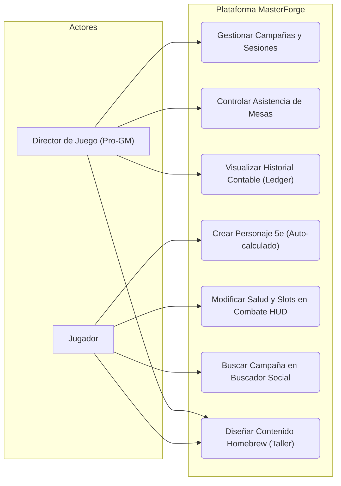
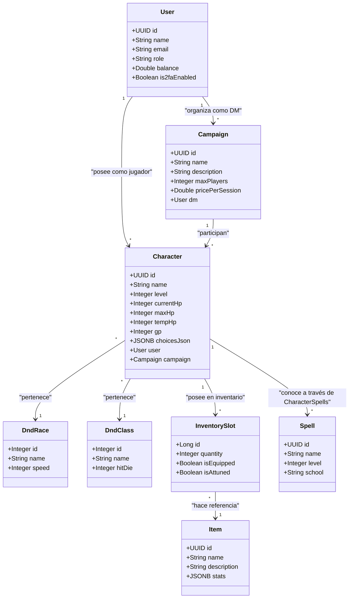
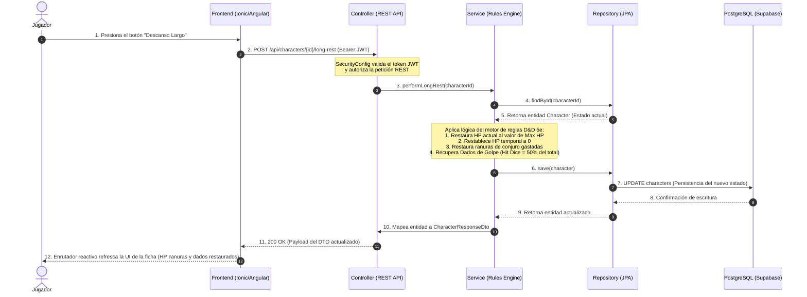
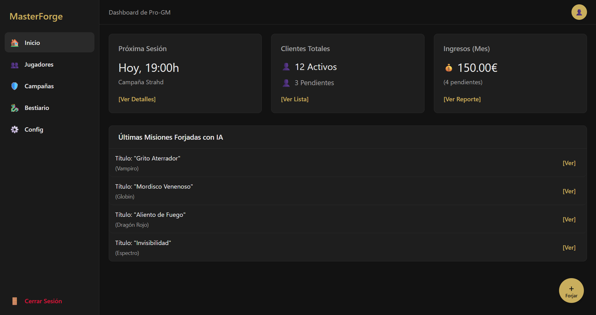
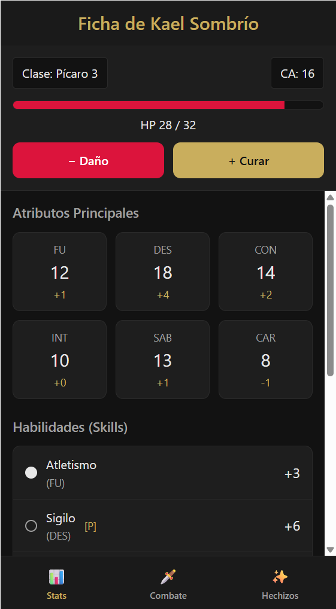

## **1\. Arquitectura del sistema**

El proyecto "MasterForge" se construye utilizando una **Arquitectura Cliente-Servidor**, implementando una separación estricta entre el *frontend* (presentación) y el *backend* (lógica de negocio y acceso a datos).

**Arquitectura por capas del Backend (Patrón N-Tier):** El servidor está estructurado internamente en capas para garantizar la escalabilidad y el mantenimiento del código:

* **Capa de Presentación / Controladores (Controllers):** Expone los *endpoints* de la API REST. Se encarga de recibir las peticiones HTTP del cliente (Ionic/Angular), validar los datos de entrada (DTOs) y devolver las respuestas HTTP correspondientes de forma segura.  
* **Capa de Lógica de Negocio (Services):** Es el "cerebro" de la aplicación. Aquí reside el Motor de Reglas de D\&D 5e (cálculo de modificadores, Clase de Armadura, Dados de Golpe, ranuras de conjuro multiclase, etc.) y la lógica de integración con la IA de asistencia y validación Homebrew. Se comunica con los controladores y los repositorios, asegurando que las reglas de negocio se cumplan antes de guardar.  
* **Capa de Acceso a Datos (Repositories):** Se encarga de la persistencia. Interactúa directamente con la base de datos relacional PostgreSQL para realizar operaciones CRUD.

**Tecnologías y frameworks:**

* **Frontend (Cliente):** 
  * *Framework:* Ionic Framework v8+ con Angular v20+.  
  * *Lenguaje:* TypeScript, HTML5, SCSS.  
  * *Herramientas:* Capacitor (para compilación a app móvil nativa Android/iOS).  
* **Backend (Servidor):**  
  * *Framework:* Spring Boot 4.x.  
  * *Lenguaje:* Kotlin.  
  * *Seguridad:* Spring Security con JWT (JSON Web Tokens) y soporte MFA (TOTP).  
  * *ORM:* Spring Data JPA / Hibernate.  
* **Base de Datos:** PostgreSQL, aprovechando su excelente soporte nativo para el tipo de dato `JSONB`, crucial para la flexibilidad y escalabilidad de las entidades dinámicas y las elecciones del Sandbox Homebrew.

## **2\. Diagramas UML**

* **Diagrama de Casos de Uso:**

* **Diagrama de Clases (Lógica de Dominio):**

* **Diagrama de Secuencia (Ejemplo: Ejecución de Descanso Largo en el Motor de Reglas D&D 5e):**

## **3\. Diseño de la base de datos**

El sistema utiliza una base de datos relacional **PostgreSQL**, diseñada para soportar tanto la gestión empresarial (SGE) como el motor de reglas de rol. El modelo lógico se divide en tres bloques principales:

1. **Módulo SGE/CRM/Facturación Simulada:**  
   * `users`: Almacena las credenciales de los jugadores y Pro-GMs, sus balances del monedero electrónico simulado, su nivel de suscripción y secretos/recuperaciones de MFA.  
   * `campaigns`: Almacena las campañas programadas por los Pro-GMs, incluyendo aforos de jugadores y tarifas por sesión.
   * `campaign_enrollments`: Controla el estado de inscripción de los personajes en las campañas.
   * `sessions` y `session_attendees`: Gestionan el calendario de aventuras y el control de cobros virtuales automatizados por sesión.  
2. **Módulo SRD (Reglas D\&D 5e Oficiales):**  
   * `dnd_races`, `dnd_classes` y `dnd_subclasses`: Tablas paramétricas que almacenan los bonificadores y dados de golpe oficiales del SRD 5.1.  
   * `class_features` y `race_traits`: Almacenan las habilidades y competencias pasivas.
3. **Módulo de Entidades Dinámicas y Homebrew:**  
   * `characters`: Fichas de personaje. Contiene claves foráneas y almacena el estado dinámico (vida actual, temporal, monedas, Dados de golpe gastados, ranuras de conjuro) y una columna `choicesJson` en `JSONB` para persistir elecciones de subida de nivel de forma flexible.  
   * `spells`, `monsters` e `items`: Almacenan el bestiario, conjuros y equipamientos oficiales y homebrew. Destacan las columnas `JSONB` para almacenar de forma eficiente las acciones y mecánicas complejas personalizadas por los usuarios.
   * `inventory_slots`: Relaciona personajes con sus objetos de forma flexible (cantidades, equipados y sintonizados).

## **4\. Diseño de la interfaz de usuario**

El diseño visual de MasterForge sigue un enfoque *Mobile-First* para la vista del Jugador (optimizada para uso en mesa durante la partida) y un enfoque tipo *Dashboard* de escritorio para la vista de gestión del Pro-GM.

* **Estilo Visual y Colores:** Se adopta un tema oscuro (Dark Mode) para reducir la fatiga visual durante las partidas nocturnas, con una estética de "fantasía moderna".  
  1. *Fondo Principal:* Gris carbón muy oscuro (ej. `#121212`).  
  2. *Superficies/Tarjetas:* Gris antracita (ej. `#1E1E1E`).  
  3. *Acentos (Botones primarios):* Oro viejo o bronce (para evocar la temática de rol sin sobrecargar).  
  4. *Alertas/Combate:* Rojo carmesí (para los botones de restar Puntos de Golpe o alertas de impagos).  
* **Pantallas Principales (Mockups):**  
  1. *Dashboard del GM (Escritorio):* 

  

2. *Character Sheet del Jugador (Móvil):*

  

## **5\. Diseño de la API o servicios externos**

MasterForge expone una API RESTful consumida por el cliente Ionic/Angular, y a su vez, actúa como cliente de un servicio externo de Inteligencia Artificial de forma controlada.

**Endpoints Principales (API Propia):**

* `POST /api/auth/login`: Autenticación y obtención de token JWT.
* `POST /api/auth/verify-2fa`: Segundo factor de autenticación seguro.
* `GET /api/characters/{id}`: Devuelve la ficha recalculada al vuelo por el motor de reglas en el backend.  
* `GET /api/campaigns/search`: Buscador con filtros reales del Gremio de Campañas.
* `POST /api/payments/simulate`: Simulación de facturación electrónica consumiendo saldo virtual.
* `GET /api/health`: Endpoint público de comprobación del estado de salud del backend REST.

**Integración con Servicios Externos (LLM API):**

* El backend se comunica de forma cifrada y segura con APIs de Inteligencia Artificial (OpenAI o Google Gemini).  
* Las claves de API se almacenan como variables de entorno seguras del servidor Kotlin en Render.  
* Se diseña una integración basada en *prompt engineering* específico donde el servidor delega exclusivamente la asistencia narrativa de descripciones Homebrew y la auditoría estática de balance contra el corpus matemático del SRD 5.1, retornando los análisis directamente al taller visual del Sandbox para que el usuario tome la decisión final de publicación.
