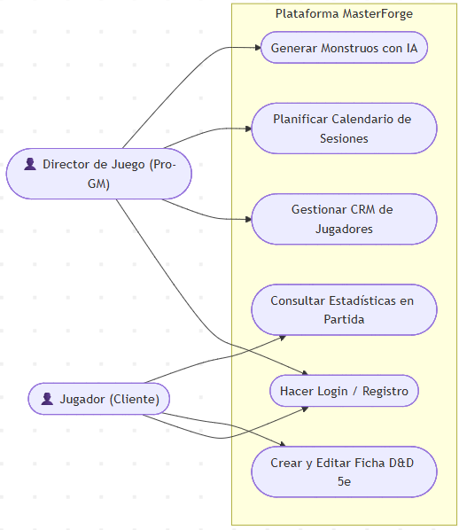
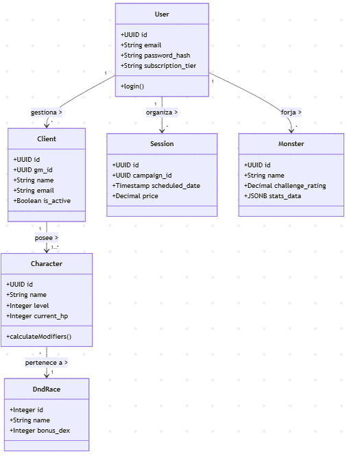
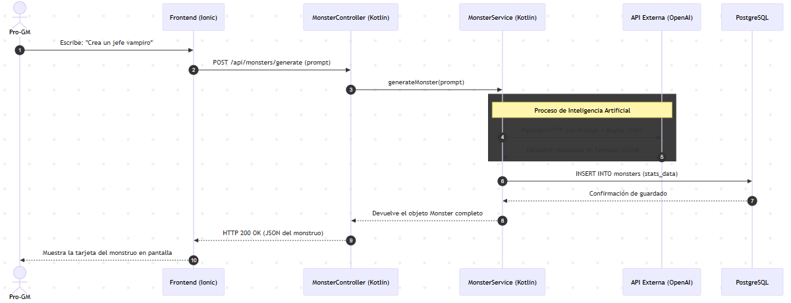
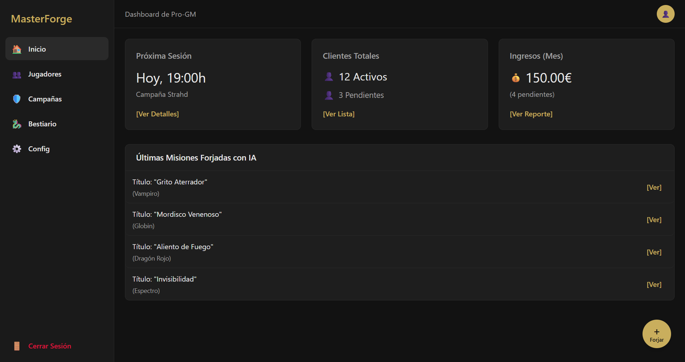
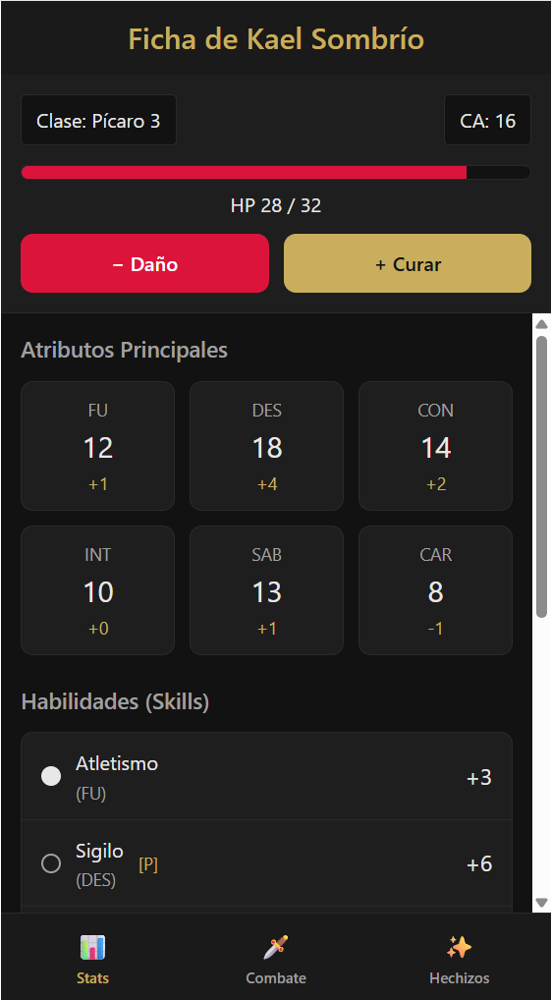

## **1. System Architecture**

The "MasterForge" project will be built using a **Client-Server Architecture**, implementing a strict separation between the *frontend* (presentation) and the *backend* (business logic and data access).

**Backend Layered Architecture (N-Tier Pattern):** The server will be internally structured in layers to ensure scalability and maintainability:

*   **Presentation Layer / Controllers:** Exposes the REST API *endpoints*. It is responsible for receiving HTTP requests from the client (Ionic), validating input data (DTOs), and returning the corresponding HTTP responses.
*   **Business Logic Layer (Services):** This is the "brain" of the application. The D&D 5e Rules Engine (calculation of modifiers, health, etc.) and the AI integration logic reside here. It communicates with controllers and repositories, ensuring that business rules are met before persisting any data.
*   **Data Access Layer (Repositories):** Responsible for persistence. It interacts directly with the relational database to perform CRUD operations (Create, Read, Update, Delete).

**Technologies and Frameworks:**

*   **Frontend (Client):**
    *   *Framework:* Ionic Framework v7+ with Angular.
    *   *Language:* TypeScript, HTML5, SCSS.
    *   *Tools:* Capacitor (for native mobile app compilation).
*   **Backend (Server):**
    *   *Framework:* Spring Boot 3.x.
    *   *Language:* Kotlin.
    *   *Security:* Spring Security with JWT (JSON Web Tokens).
    *   *ORM:* Spring Data JPA / Hibernate.
*   **Database:** PostgreSQL (chosen for its excellent native support for the `JSONB` data type, crucial for bestiary flexibility).

## **2. UML Diagrams**

*   **Use Case Diagram:**

  

*   **Class Diagram (Domain Logic):**

  

*   **Sequence Diagram (Example: AI Monster Generation):**

  

## **3. Database Design**

The system uses a **PostgreSQL** relational database, designed to support both business management (ERP) and the RPG rules engine. The logical model is divided into three main blocks:

1.  **ERP/CRM Module:**
    *   `users`: Stores the Dungeon Master's (Pro-GM) credentials and subscription level.
    *   `clients`: Stores the portfolio of players associated with a Pro-GM.
    *   `sessions` and `session_attendees` (Join table): Manage the event calendar and attendance payment tracking.
2.  **SRD Module (D&D 5e Rules):**
    *   `dnd_races` and `dnd_classes`: Lookup tables (dictionaries) storing official statistical bonuses (e.g., hit dice, ability score increases). The backend reads from here to automate calculations.
3.  **Dynamic Entities Module:**
    *   `characters`: Player character sheets. Contains foreign keys to races and classes, and stores base characteristic rolls and dynamic state (current Hit Points).
    *   `monsters`: Stores the Master's bestiary. It features a `JSONB` column (`stats_data`) to flexibly and efficiently store complex attributes and actions generated by the AI.

## **4. User Interface Design**

The visual design of MasterForge will follow a *Mobile-First* approach for the Player view (optimized for at-the-table use) and a desktop-style *Dashboard* approach for the Pro-GM management view.

*   **Visual Style and Colors:** A dark theme (Dark Mode) will be adopted to reduce eye strain during night sessions, with a "modern fantasy" aesthetic.
    1.  *Main Background:* Very dark charcoal gray (e.g., `#121212`).
    2.  *Surfaces/Cards:* Anthracite gray (e.g., `#1E1E1E`).
    3.  *Accents (Primary buttons):* Old gold or bronze (to evoke an RPG theme without overwhelming the user).
    4.  *Alerts/Combat:* Crimson red (for Hit Point reduction buttons or payment alerts).
*   **Main Screens (Mockups):**
    1.  *GM Dashboard (Desktop):*

  

2.  *Player Character Sheet (Mobile):*

  

## **5. API Design or External Services**

MasterForge will expose a RESTful API consumed by the Ionic client and will also act as a client for an external Artificial Intelligence service.

**Key Endpoints (Internal API):**

*   `POST /api/auth/login`: Authentication and JWT token retrieval.
*   `GET /api/clients`: Retrieves a Pro-GM's player list (JWT protected).
*   `POST /api/sessions`: Creates a new calendar event.
*   `GET /api/characters/{id}`: Returns a character sheet. The backend calculates total modifiers on the fly before sending the JSON response.

**External Service Integration (LLM API):**

*   The backend will communicate with the OpenAI API (or equivalent, such as Google Gemini).
*   Requests will be made via a secure HTTP POST (storing the API Key in Kotlin environment variables).
*   The server will send a strict *System Prompt* instructing the AI to act as a D&D 5e content creator and return information **exclusively in a predefined JSON format** (no conversational text), allowing the Kotlin backend to parse and insert it directly into the `monsters` table.