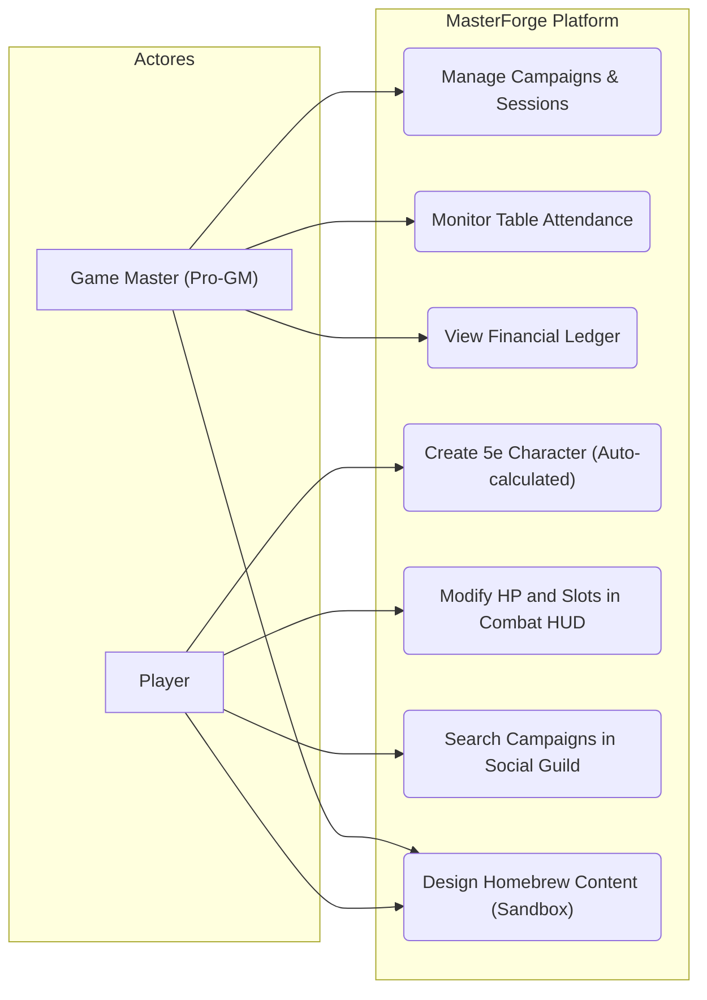
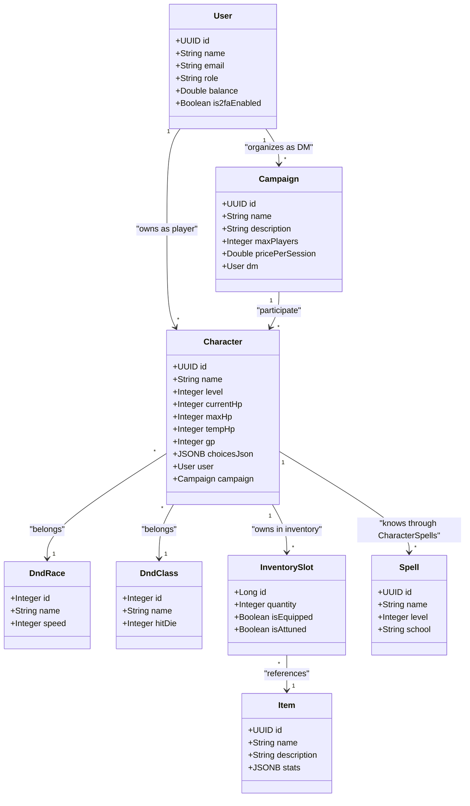
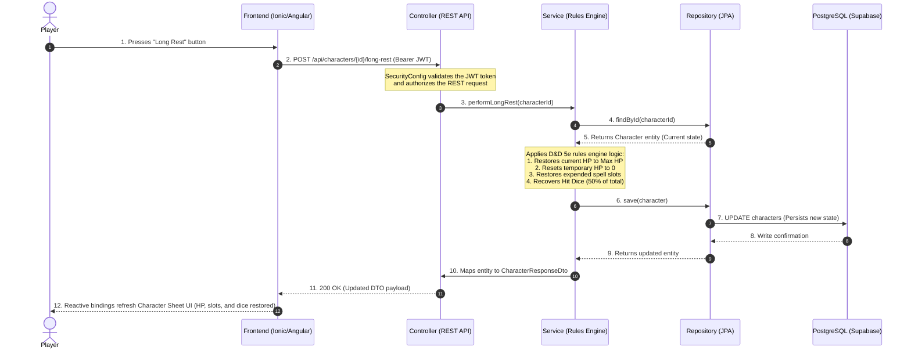

## **1\. System Architecture**

The "MasterForge" project is built using a **Client-Server Architecture**, implementing a strict separation between the *frontend* (presentation) and the *backend* (business logic and data access).

**Backend Layered Architecture (N-Tier Pattern):** The server is internally structured in layers to ensure scalability and maintainability:

* **Presentation Layer / Controllers:** Exposes the REST API *endpoints*. It is responsible for receiving HTTP requests from the client (Ionic/Angular), validating input DTOs, and returning corresponding secure HTTP responses.  
* **Business Logic Layer (Services):** The "brain" of the application. The D\&D 5e Rules Engine (calculation of modifiers, Armor Class, Hit Dice, multiclass combined spell slots, etc.) and the AI homebrew co-creation and balance validation service logic reside here. It communicates with controllers and repositories, ensuring that business rules are met before persisting data.  
* **Data Access Layer (Repositories):** Responsible for persistence. It interacts directly with the PostgreSQL relational database to perform CRUD operations.

**Technologies and Frameworks:**

* **Frontend (Client):** 
  * *Framework:* Ionic Framework v8+ with Angular v20+.  
  * *Language:* TypeScript, HTML5, SCSS.  
  * *Tools:* Capacitor (for native mobile app compilation on Android/iOS).  
* **Backend (Server):**  
  * *Framework:* Spring Boot 4.x.  
  * *Language:* Kotlin.  
  * *Security:* Spring Security with JWT (JSON Web Tokens) and MFA support (TOTP).  
  * *ORM:* Spring Data JPA / Hibernate.  
* **Database:** PostgreSQL, leveraging its excellent native support for the `JSONB` data type, crucial for the flexibility and scalability of dynamic entities and Sandbox Homebrew configurations.

## **2\. UML Diagrams**

* **Use Case Diagram:**

```mermaid
flowchart LR
    subgraph Actores
        GM["Game Master (Pro-GM)"]
        PL["Player"]
    end

    subgraph MasterForge["MasterForge Platform"]
        UC1("Manage Campaigns & Sessions")
        UC2("Monitor Table Attendance")
        UC3("View Financial Ledger")
        UC4("Create 5e Character (Auto-calculated)")
        UC5("Modify HP and Slots in Combat HUD")
        UC6("Search Campaigns in Social Guild")
        UC7("Design Homebrew Content (Sandbox)")
    end

    GM --> UC1
    GM --> UC2
    GM --> UC3
    GM --> UC7

    PL --> UC4
    PL --> UC5
    PL --> UC6
    PL --> UC7
```

* **Class Diagram (Domain Logic):**

```mermaid
classDiagram
    direction TB
    class User {
        +UUID id
        +String name
        +String email
        +String role
        +Double balance
        +Boolean is2faEnabled
    }
    class Campaign {
        +UUID id
        +String name
        +String description
        +Integer maxPlayers
        +Double pricePerSession
        +User dm
    }
    class Character {
        +UUID id
        +String name
        +Integer level
        +Integer currentHp
        +Integer maxHp
        +Integer tempHp
        +Integer gp
        +JSONB choicesJson
        +User user
        +Campaign campaign
    }
    class DndRace {
        +Integer id
        +String name
        +Integer speed
    }
    class DndClass {
        +Integer id
        +String name
        +Integer hitDie
    }
    class Item {
        +UUID id
        +String name
        +String description
        +JSONB stats
    }
    class InventorySlot {
        +Long id
        +Integer quantity
        +Boolean isEquipped
        +Boolean isAttuned
    }
    class Spell {
        +UUID id
        +String name
        +Integer level
        +String school
    }
    
    User "1" --> "*" Campaign : "organizes as DM"
    User "1" --> "*" Character : "owns as player"
    Campaign "1" --> "*" Character : "participate"
    Character "*" --> "1" DndRace : "belongs"
    Character "*" --> "1" DndClass : "belongs"
    Character "1" --> "*" InventorySlot : "owns in inventory"
    InventorySlot "*" --> "1" Item : "references"
    Character "1" --> "*" Spell : "knows through CharacterSpells"
```

* **Sequence Diagram (Example: Executing a Long Rest in the D&D 5e Rules Engine):**

```mermaid
sequenceDiagram
    autonumber
    actor Player as Player
    participant Front as Frontend (Ionic/Angular)
    participant Ctrl as Controller (REST API)
    participant Serv as Service (Rules Engine)
    participant Repo as Repository (JPA)
    participant DB as PostgreSQL (Supabase)

    Player->>Front: 1. Presses "Long Rest" button
    Front->>Ctrl: 2. POST /api/characters/{id}/long-rest (Bearer JWT)
    Note over Ctrl: SecurityConfig validates the JWT token<br/>and authorizes the REST request
    Ctrl->>Serv: 3. performLongRest(characterId)
    Serv->>Repo: 4. findById(characterId)
    Repo-->>Serv: 5. Returns Character entity (Current state)
    Note over Serv: Applies D&D 5e rules engine logic:<br/>1. Restores current HP to Max HP<br/>2. Resets temporary HP to 0<br/>3. Restores expended spell slots<br/>4. Recovers Hit Dice (50% of total)
    Serv->>Repo: 6. save(character)
    Repo->>DB: 7. UPDATE characters (Persists new state)
    DB-->>Repo: 8. Write confirmation
    Repo-->>Serv: 9. Returns updated entity
    Serv->>Ctrl: 10. Maps entity to CharacterResponseDto
    Ctrl-->>Front: 11. 200 OK (Updated DTO payload)
    Front-->>Player: 12. Reactive bindings refresh Character Sheet UI (HP, slots, and dice restored)
```

## **3\. Database Design**

The system uses a **PostgreSQL** relational database, designed to support both business management (ERP) and the RPG rules engine. The logical model is divided into three main blocks:

1. **SGE/CRM/Simulated Billing Module:**  
   * `users`: Stores user credentials, simulated wallet balances, subscription level, and MFA configuration secrets/recodes.  
   * `campaigns`: Stores scheduled campaigns created by Pro-GMs, including player capacity limits and fees per session.
   * `campaign_enrollments`: Manages active character registrations in campaigns.
   * `sessions` and `session_attendees`: Manage the calendar of adventures and automated virtual session billing tracking.  
2. **SRD Module (Official D\&D 5e Rules):**  
   * `dnd_races`, `dnd_classes`, and `dnd_subclasses`: Parametric lookup tables storing official SRD 5.1 statistical bonuses (e.g., hit dice, class traits).  
   * `class_features` and `race_traits`: Store passive skills and competencies.
3. **Dynamic Entities & Homebrew Module:**  
   * `characters`: Character sheets storing active state (health, temporary HP, currencies, spent hit dice, spell slots) and a `choicesJson` `JSONB` column to persist leveling selections flexibly.  
   * `spells`, `monsters`, and `items`: Store official and homebrew custom assets, utilizing `JSONB` columns to store custom actions and properties modularly.
   * `inventory_slots`: Relates characters to items flexibly (quantities, equipped, and attuned states).

## **4\. User Interface Design**

The visual design of MasterForge follows a *Mobile-First* approach for the Player view (optimized for at-the-table use) and a desktop-style *Dashboard* approach for the Pro-GM management view.

* **Visual Style and Colors:** A dark theme (Dark Mode) is adopted to reduce eye strain during night sessions, with a "modern fantasy" aesthetic.  
  1. *Main Background:* Very dark charcoal gray (e.g., `#121212`).  
  2. *Surfaces/Cards:* Anthracite gray (e.g., `#1E1E1E`).  
  3. *Accents (Primary buttons):* Old gold or bronze (to evoke an RPG theme without overwhelming the user).  
  4. *Alerts/Combat:* Crimson red (for Hit Point reduction buttons or payment alerts).  
* **Main Screens (Mockups):**  
  1. *GM Dashboard (Desktop):* 

  

2. *Player Character Sheet (Mobile):*

  

## **5\. API Design or External Services**

MasterForge exposes a RESTful API consumed by the Ionic client and acts as a client for an external Artificial Intelligence service.

**Key Endpoints (Internal API):**

* `POST /api/auth/login`: Authentication and JWT token retrieval.
* `POST /api/auth/verify-2fa`: Second-factor secure verification.
* `GET /api/characters/{id}`: Returns the character sheet recalculated on the fly by the rules engine in the backend.  
* `GET /api/campaigns/search`: Social campaign finder with 5 active query filters.
* `POST /api/payments/simulate`: Simulated billing transaction processing.
* `GET /api/health`: Public backend REST API health verification endpoint.

**External Service Integration (LLM API):**

* The backend communicates securely with LLM APIs (OpenAI or Google Gemini) using HTTPS.  
* API keys are stored as secure environment variables of the Kotlin server in Render.  
* The integration is built using strict *prompt engineering* where the server delegates homebrew content narrative generation assistance and static mathematical balance reviews against the SRD 5.1 database, returning findings to the Sandbox visual builder to guide user creations.